# Nanda Town — Enterprise Technical Documentation

**Version:** 3.0 (Forensic Audit)  
**Audit Date:** 2026-06-24  
**Repository:** [projnanda/nandatown](https://github.com/projnanda/nandatown)  
**Auditor Role:** Senior Enterprise Architect, Principal Software Engineer, Security Architect, AI Systems Architect  
**Baseline:** `uv sync` + ruff + pyright + **541 passed, 1 skipped** (542 collected; local, Python 3.14.4); `nest doctor` 7/7; `nest run marketplace` trace produced

---

## Marker Legend

| Marker | Meaning |
|--------|---------|
| `[OBSERVED: ...]` | Confirmed from repository materials or local execution |
| `[INFERRED: ...]` | Reasonably deduced from context |
| `[INFERRED STRATEGY BASED ON MARKET STANDARD: ...]` | Best-practice recommendation where evidence is missing |
| `[MISSING]` | Information not available in materials |
| `[RISK: ...]` | Identified exposure, weakness, or vulnerability |
| `[DEPRECATED]` | Legacy or outdated design |

---

# 1. Executive Summary

[OBSERVED] **Nanda Town** is an Apache 2.0, Alpha-status **agent-protocol testing rig** developed at MIT Media Lab. It is distributed primarily as the PyPI package `nest-core` (v0.1.4). The system spins up swarms of 10–10,000+ agents, composes a **12-layer agent stack** via pluggable Python `Protocol` interfaces, runs adversarial scenarios (marketplace, auction, voting, consensus, supply chain, reputation), and emits **byte-deterministic JSONL traces** validated by property checkers.

[OBSERVED] This is **not** a production SaaS, multi-tenant platform, or networked microservice mesh. It is a **testing tool first, simulator second** — explicitly documented in README and `docs/concepts.md`.

**Strategic positioning for stakeholders:**

| Stakeholder | Key Message |
|-------------|-------------|
| C-level / investors | Foundational infrastructure for the emerging agent-economy protocol layer; open-source wedge with hackathon-driven ecosystem growth |
| Solution architects | Composable 12-layer reference architecture for MAS (multi-agent system) protocol interoperability testing |
| Engineering | Mature dev ergonomics: uv workspace, strict pyright, 542+ tests, plugin entry points, deterministic Tier 1 regression |
| Security | Reference plugins are **simulation scaffolding** — must not be deployed to production without replacement |
| AI teams | Tier 2 LLM agents (`nest-shell`), automated LLM judge panel (`scripts/judge`), research harness (`scripts/harness`) |

**Maturity assessment:** Alpha research tooling with production-grade engineering discipline (CI, typing, property tests) but **no** production deployment, observability stack, or compliance certifications.

**Top 5 findings:**

1. **[RISK]** Default `jwt`, `did_key`, `noop` privacy, and `prepaid_credits` plugins are deliberately non-production — misuse risk if consumers skip README warnings.
2. **[OBSERVED]** Strong determinism story: seeded RNG, JSONL traces, 30+ property validators — excellent for protocol regression.
3. **[OBSERVED]** AI subsystems exist: ShellAgent (OpenAI/Anthropic/mock), parallel Opus judge panel, harness condition sweeps.
4. **[MISSING]** No network transport (TCP/gRPC/HTTP), no distributed execution, no persistent datastore.
5. **[INFERRED]** High strategic value as **protocol CI** for agent fleets — comparable to property-based testing for distributed systems.

---

# 2. Gap Analysis

## 2.1 Completeness Assessment (Phase 1.1)

| Category | Check | Status | Gap Description |
|----------|-------|--------|-----------------|
| Business | Clear objective defined | **Pass** | [OBSERVED] README: test rig for agent protocols |
| Business | Monetization model documented | **Gap** | [MISSING] No commercial model; hackathon + open source only |
| Architecture | ADRs exist | **Partial** | [OBSERVED] Formal ADRs in [`docs/adr/`](adr/) (2026-06-25) |
| Security | Authentication documented | **Partial** | [OBSERVED] `JwtAuth` documented as simulation-only in plugin docstrings |
| Engineering | Error handling strategy | **Partial** | [OBSERVED] Pydantic validation, `ValueError` on bad tokens; no global error taxonomy |
| Engineering | Validation and retry logic | **Pass** | [OBSERVED] `validators.py` (65KB), hypothesis property tests |
| Engineering | Rollback/compensation | **Gap** | [MISSING] No saga/compensation framework |
| Operations | Observability standards | **Partial** | [OBSERVED] Trace JSON Schema v1 + stderr LLM token telemetry (`NEST_LLM_TELEMETRY`); no OTel export |
| Operations | Logging and alerting | **Partial** | [OBSERVED] JSONL traces + optional stderr telemetry; no alerting pipeline |
| API | Schema and contract defined | **Partial** | [OBSERVED] Pydantic `ScenarioConfig`, trace event dicts; no OpenAPI |
| Data | Normalization strategy | **N/A** | [OBSERVED] In-memory; no persistent DB |
| Data | Indexing strategy | **N/A** | Trace files are linear JSONL |
| Data | Lineage documented | **Partial** | Section 8.6 |
| DevOps | Deployment architecture | **Partial** | [OBSERVED] GitHub Actions CI + PyPI publish; `.railwayignore` hints optional hosting |
| DevOps | Environment promotion | **Gap** | [MISSING] No dev/staging/prod tiers |
| Governance | Dependency governance | **Partial** | [OBSERVED] uv lock, pinned pyright; CycloneDX SBOM artifact in CI (2026-06-25) |
| Quality | Test strategy | **Pass** | [OBSERVED] pytest, hypothesis, 552 tests, `@pytest.mark.live` for external |
| Reliability | SLOs/SLIs | **Gap** | [MISSING] |
| Resilience | Chaos testing | **Partial** | [OBSERVED] Failure injection: message_drop, byzantine_agents, partitions |
| AI | AI governance framework | **Partial** | [OBSERVED] Judge rubric v1; no NIST RMF formal mapping |
| Cloud | Multi-cloud strategy | **Gap** | [MISSING] Local + CI only |
| Sustainability | Carbon footprint | **Gap** | Section 15 |

## 2.2 Consistency Validation (Phase 1.2)

| Alignment Area | Status | Notes |
|----------------|--------|-------|
| CLI ↔ backend workflows | **Aligned** | `nest run` → `ScenarioRunner` → `Simulator` |
| API contracts ↔ frontend | **N/A** | Dashboard reads local JSONL files; no REST API |
| Data model ↔ business rules | **Aligned** | Pydantic types match layer interfaces |
| CI/CD ↔ deployment | **Aligned** | CI runs ruff, pyright, pytest; publish.yml stages PyPI |
| Dependencies ↔ goals | **Aligned** | Minimal runtime deps; optional LLM extras |
| Security claims ↔ implementation | **Aligned with caveat** | Docs warn reference plugins are non-production |
| Business capabilities ↔ components | **Aligned** | Protocol testing maps to nest-core + validators |
| AI claims ↔ orchestration | **Aligned** | Tier 2 shell + judge panel verified in code |

---

# 3. Risk Register

| Risk ID | Category | Description | Severity | Likelihood | Impact | Mitigation |
|---------|----------|-------------|----------|------------|--------|------------|
| R-001 | Security | Reference `JwtAuth` uses HMAC pipe-delimited tokens, not RFC 7519 JWT | High | Medium | Credential confusion in production | [OBSERVED] Runtime `UserWarning` on init + documentation |
| R-002 | Security | `did_key` identity is deterministic simulation crypto, not Ed25519 | High | Medium | False security assurance | Use `ed25519_rotating` plugin for real crypto tests |
| R-003 | Security | `NoopPrivacy` passes data through unencrypted | High | High if misused | Data exposure | Never use outside simulation |
| R-004 | Architecture | Single-process simulator — no distributed fault domains | Medium | Certain | Cannot test real network partitions | [INFERRED] Add TCP/gRPC transport plugin |
| R-005 | AI | Judge panel sends PR diffs to Anthropic API — prompt injection via malicious PR | Medium | Low | API abuse, cost | Truncate diffs (5000 lines/file); human review |
| R-006 | AI | Tier 2 ShellAgent non-deterministic — benchmark invalidity | Medium | High if misused | Wrong conclusions | README warns: not for benchmarks |
| R-007 | Operational | No secrets manager for `OPENAI_API_KEY` / `ANTHROPIC_API_KEY` | Medium | Medium | Key leakage in CI logs | Use GitHub secrets; env-only |
| R-008 | Business | Alpha status — API breaking changes likely | Medium | High | Integration breakage | Semantic versioning on PyPI packages |
| R-009 | Compliance | No GDPR/SOC2 — traces may contain simulated PII patterns | Low | Low | Compliance blocker for enterprise adoption | Mark traces as synthetic |
| R-010 | Sustainability | Large-scale sweeps (10K agents × many seeds) CPU-intensive | Low | Medium | Energy cost | Document batch sizing guidance |

## Phase 1.4 Assumption Register

| Assumption ID | Assumption | Basis | Validation Required |
|---------------|------------|-------|-------------------|
| A-001 | Users understand reference plugins are non-production | README, charter | User survey / install warning |
| A-002 | Protocol authors target one layer at a time | Plugin entry-point design | Hackathon PR analysis |
| A-003 | JSONL traces are sufficient audit evidence | Trace schema, validators | Formal trace schema publication |
| A-004 | Python 3.12+ is acceptable floor | pyproject.toml | Monitor 3.14 compatibility |
| A-005 | Anthropic Opus is acceptable judge model | `judge_pr.py` defaults | Cost/latency benchmarking |

## Phase 1.5 Architecture Review Board Charter

| Element | Definition |
|---------|------------|
| Purpose | Govern layer interface changes, plugin contracts, scenario schemas |
| Membership | [INFERRED] MIT Media Lab maintainers, principal contributors, security reviewer |
| Cadence | [MISSING] — recommend weekly PR review, monthly interface stability review |
| Escalation | Maintainer → project lead → MIT Media Lab sponsor |
| Decision Criteria | Determinism preservation, API backward compatibility, test coverage, security of defaults |

---

# 4. Business Architecture (Phase 0)

## 0.1 Business Capability Model

| Capability | Description | Supporting Systems | Maturity | Business Impact |
|------------|-------------|-------------------|----------|-----------------|
| Protocol validation | Prove agent protocol correctness under swarm conditions | nest-core, validators | Emerging | High — core value prop |
| Adversarial testing | Inject drops, Byzantine agents, partitions | Simulator failure config | Emerging | High |
| Plugin ecosystem | Third-party layer implementations | PluginRegistry, entry points | Emerging | Medium — hackathon driver |
| Trace analysis | Inspect, report, dashboard traces | CLI inspect/report/dashboard | Established | Medium |
| LLM agent exploration | Emergent behavior with real LLMs | nest-shell Tier 2 | Experimental | Medium |
| Hackathon operations | Score PRs, maintain leaderboard | scripts/judge, nest-marketplace | Emerging | Medium — community growth |
| Research automation | Condition sweeps, calibration | scripts/harness | Experimental | Low-Medium |

## 0.2 Capability-to-Application Mapping

| Business Capability | Application / Service | Owner | Criticality | Notes |
|---------------------|----------------------|-------|-------------|-------|
| Protocol validation | `nest-core` | Core team | Critical | PyPI primary artifact |
| Plugin authoring | `nest-sdk` | Core team | Critical | Public API surface |
| Reference implementations | `nest-plugins-reference` | Core team | High | Default host stack |
| LLM agents | `nest-shell` | Core team | Medium | Optional extra |
| Hackathon UI data | `nest-marketplace` | Core team | Low | Static JSON builder |
| Scoreboard UI | `apps/dashboard` | Community | Low | HTML trace viewer |
| PR judging | `scripts/judge` | Core team | Medium | Hackathon only |

## 0.3 Business Process Heat Map

| Process | Volume | Pain Point | Current Tooling | Automation Potential | Priority |
|---------|--------|------------|-----------------|---------------------|----------|
| Plugin development | Medium (hackathon) | Learning 12 layers | docs/layers/, writing-a-plugin.md | Template generator (`nest init`) | High |
| Scenario authoring | Medium | YAML schema complexity | `ScenarioConfig` Pydantic | Schema IDE validation | Medium |
| Regression testing | High | Comparing traces across plugin versions | `nest report`, validators | CI trace diff gate | High |
| Hackathon submission | Burst | Rubric interpretation | judge panel | Fully automated scoring | Medium |
| LLM exploration | Low | Non-determinism | shell_marketplace | Mock backend for dev | Low |

## 0.4 Wardley Map Positioning

| Component | Evolution Stage | Strategic Importance | Recommended Action |
|-----------|-----------------|---------------------|-------------------|
| 12-layer protocol taxonomy | Custom-built | Differentiating | Invest — publish as standard |
| Discrete-event simulator | Product | Differentiating | Invest — add network transport |
| Reference plugins | Commodity (for testing) | Low (as defaults) | Replace per-layer in production use |
| Property validators | Custom-built | Differentiating | Expand per scenario |
| JSONL trace format | Commodity | Medium | Standardize schema version |
| LLM judge panel | Custom-built | Medium | Productize for other OSS projects |
| PyPI distribution | Commodity | Medium | Maintain |
| OpenAI/Anthropic APIs | Commodity | Low (dependency) | Abstract via LLMBackend protocol |

---

# 5. Functional Decomposition (Phase 2)

## 2.1 Functional Decomposition Matrix

| Feature ID | User Action | UI Screen | Frontend Trigger | Frontend Method | Backend Endpoint | Service Layer | DB Operation | External API | Async Job | Expected Output | Failure States |
|------------|-------------|-----------|------------------|-----------------|------------------|---------------|--------------|--------------|-----------|-----------------|----------------|
| F-001 | Run scenario | CLI terminal | `nest run marketplace` | Typer CLI | N/A (in-process) | `ScenarioRunner.run()` | None (in-memory) | None (Tier 1) | `Simulator.run()` async | JSONL trace file | Invalid YAML, plugin KeyError |
| F-002 | Validate trace | CLI / Python | `validate_trace(path, name)` | Python import | N/A | `validators.validate_trace` | Read JSONL | None | Sync | List of ValidationResult | Missing file, unknown scenario |
| F-003 | Inspect trace | CLI | `nest inspect trace.jsonl` | Typer | N/A | `inspect.summarize_trace` | Read JSONL | None | Sync | Terminal summary | Empty trace |
| F-004 | HTML report | CLI | `nest report trace.jsonl -o r.html` | Typer | N/A | `metrics.build_report` | Read JSONL | None | Sync | HTML file | Parse error |
| F-005 | Dashboard | CLI + browser | `nest dashboard trace.jsonl` | HTTP server (local) | localhost | Static HTML + fetch | Read JSONL | None | Sync server | Browser UI | Port conflict |
| F-006 | Register plugin | pyproject.toml | `pip install -e .` | setuptools entry points | N/A | `PluginRegistry._discover_entry_points` | None | None | Import-time | Plugin resolvable | Missing entry point group |
| F-007 | Init new plugin | CLI | `nest init my_plugin` | Typer | N/A | `cli.init` | Write files | None | Sync | Scaffold directory | Exists overwrite |
| F-008 | Doctor check | CLI | `nest doctor` | Typer | N/A | Import + plugin resolve smoke | None | None | Sync | 7/7 checks | Import failure |
| F-009 | Shell marketplace | CLI | `nest run shell_marketplace` | Typer | N/A | `ScenarioRunner` + `nest_shell` | None | OpenAI/Anthropic | Async LLM calls | JSONL trace | API key missing |
| F-010 | Judge hackathon PR | CLI | `python -m scripts.judge.run_all` | argparse | GitHub REST API | `judge_pr.judge_pr` | Write scores.json | Anthropic API | Async parallel judges | Scoreboard JSON | API rate limit |
| F-011 | Copy scenario | CLI | `nest scenarios cp marketplace .` | Typer | N/A | `scenarios_cp` | Write YAML | None | Sync | Local YAML | Not found |
| F-012 | List plugins | CLI | `nest plugins list` | Typer | N/A | `PluginRegistry.list_plugins` | None | None | Sync | Plugin table | None |

## 2.2 State Transition Mapping

| Flow | Initial State | Trigger Event | Next State | Error State | Recovery Path |
|------|---------------|---------------|------------|-------------|---------------|
| Scenario run | Config loaded | `runner.run()` start | Plugins resolved | KeyError on plugin | Fix YAML layer name |
| Simulation | Agents created | Event queue non-empty | Processing events | Max ticks exceeded | Increase `duration.ticks` |
| Agent message | Idle | `ctx.send()` | Message queued | Drop (failure injection) | Retry at application layer |
| Trace write | Run complete | `TraceWriter.close()` | File flushed | Disk full | Free space, re-run |
| Token auth | No token | `auth.issue()` | Token issued | Invalid scopes | Fix caller |
| Token verify | Token presented | `auth.verify()` | AuthContext | Revoked/invalid | Re-issue token |
| Judge PR | PR fetched | `judge_pr(n)` | Verdicts aggregated | API error | Mock judge fallback |

## 2.5 API-to-UI Traceability Matrix

| Screen / Page | Component | API Endpoint | Method | Request Payload | Response Model | Error Handling | Loading Strategy |
|---------------|-----------|--------------|--------|-----------------|----------------|----------------|------------------|
| CLI run | Typer `run` | In-process | N/A | Scenario path/name | Trace path | `typer.Exit(1)` | Spinner via Rich |
| Dashboard | `apps/dashboard/index.html` | Local file fetch | GET | JSONL path param | Event array | Console error | Client-side parse |
| Hackathon UI | nest-marketplace JSON | Static file | N/A | N/A | scores.json schema | [MISSING] error UI | Static load |
| Python SDK | `validate_trace` | Function call | N/A | Path + scenario name | `list[ValidationResult]` | Exception | Sync |

---

# 6. Process Flow Diagrams

## 6.1 Plugin Registration and Onboarding

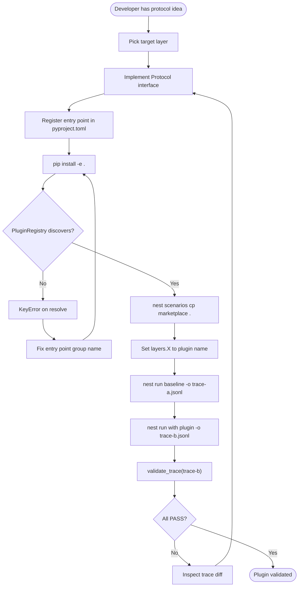
```mermaid
flowchart TD
    Start([Developer has protocol idea]) --> PickLayer[Pick target layer]
    PickLayer --> Implement[Implement Protocol interface]
    Implement --> EntryPoint[Register entry point in pyproject.toml]
    EntryPoint --> Install["pip install -e ."]
    Install --> Discover{PluginRegistry discovers?}
    Discover -->|No| FailKey[KeyError on resolve]
    FailKey --> FixEP[Fix entry point group name]
    FixEP --> Install
    Discover -->|Yes| CopyScenario["nest scenarios cp marketplace ."]
    CopyScenario --> EditYAML[Set layers.X to plugin name]
    EditYAML --> RunBaseline["nest run baseline -o trace-a.jsonl"]
    RunBaseline --> RunPlugin["nest run with plugin -o trace-b.jsonl"]
    RunPlugin --> Validate["validate_trace(trace-b)"]
    Validate --> Pass{All PASS?}
    Pass -->|No| Debug[Inspect trace diff]
    Debug --> Implement
    Pass -->|Yes| Done([Plugin validated])
```

## 6.2 Authentication and Session Lifecycle (Simulation Auth Layer)

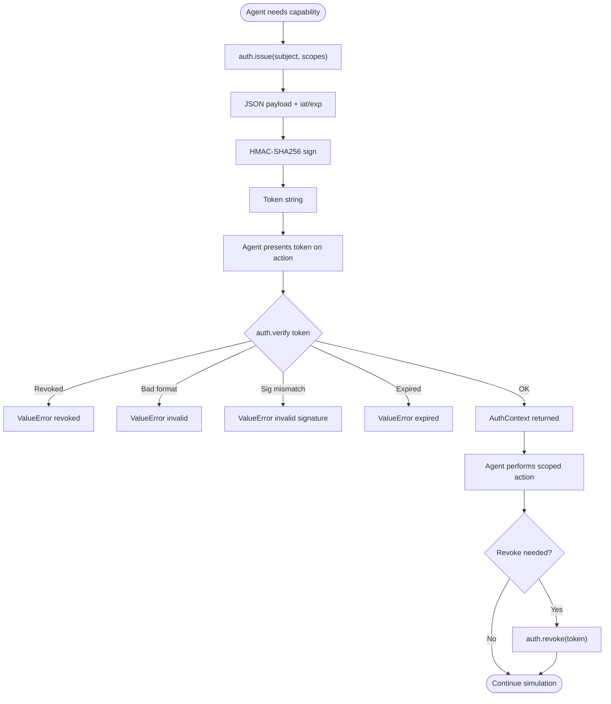
```mermaid
flowchart TD
    Start([Agent needs capability]) --> Issue["auth.issue(subject, scopes)"]
    Issue --> BuildPayload[JSON payload + iat/exp]
    BuildPayload --> Sign[HMAC-SHA256 sign]
    Sign --> Token[Token string]
    Token --> Use[Agent presents token on action]
    Use --> Verify{auth.verify token}
    Verify -->|Revoked| ErrRevoked[ValueError revoked]
    Verify -->|Bad format| ErrFormat[ValueError invalid]
    Verify -->|Sig mismatch| ErrSig[ValueError invalid signature]
    Verify -->|Expired| ErrExp[ValueError expired]
    Verify -->|OK| Ctx[AuthContext returned]
    Ctx --> Action[Agent performs scoped action]
    Action --> RevokeOptional{Revoke needed?}
    RevokeOptional -->|Yes| Revoke["auth.revoke(token)"]
    RevokeOptional -->|No| End([Continue simulation])
    Revoke --> End
```

## 6.3 Core Transaction Flow (Marketplace Scenario)

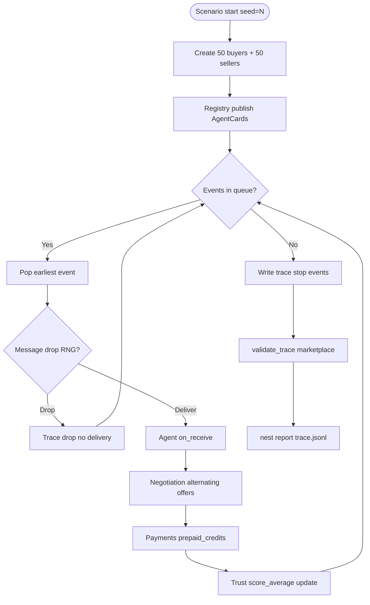
```mermaid
flowchart TD
    Start([Scenario start seed=N]) --> InitAgents[Create 50 buyers + 50 sellers]
    InitAgents --> Register[Registry publish AgentCards]
    Register --> Loop{Events in queue?}
    Loop -->|No| EndRun[Write trace stop events]
    Loop -->|Yes| Dequeue[Pop earliest event]
    Dequeue --> DropCheck{Message drop RNG?}
    DropCheck -->|Drop| LogDrop[Trace drop no delivery]
    DropCheck -->|Deliver| Receive[Agent on_receive]
    LogDrop --> Loop
    Receive --> Negotiate[Negotiation alternating offers]
    Negotiate --> Pay[Payments prepaid_credits]
    Pay --> TrustUpdate[Trust score_average update]
    TrustUpdate --> Loop
    EndRun --> Validate["validate_trace marketplace"]
    Validate --> Report["nest report trace.jsonl"]
```

## 6.4 Background Job and Queue Processing (Event Simulator)

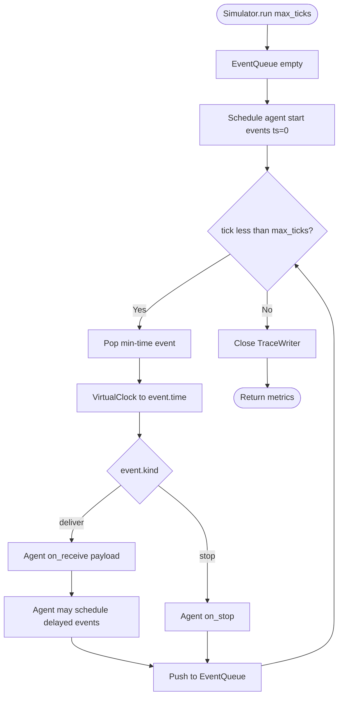
```mermaid
flowchart TD
    Start([Simulator.run max_ticks]) --> InitQueue[EventQueue empty]
    InitQueue --> StartAgents[Schedule agent start events ts=0]
    StartAgents --> Tick{tick less than max_ticks?}
    Tick -->|No| CloseTrace[Close TraceWriter]
    Tick -->|Yes| PopEvent[Pop min-time event]
    PopEvent --> AdvanceClock[VirtualClock to event.time]
    AdvanceClock --> Kind{event.kind}
    Kind -->|deliver| Deliver[Agent on_receive payload]
    Kind -->|stop| StopAgent[Agent on_stop]
    Deliver --> ScheduleNew[Agent may schedule delayed events]
    ScheduleNew --> PushQueue[Push to EventQueue]
    StopAgent --> PushQueue
    PushQueue --> Tick
    CloseTrace --> Done([Return metrics])
```

## 6.5 API Request Lifecycle (CLI Command)

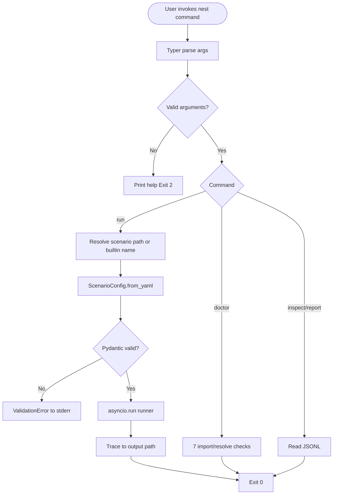
```mermaid
flowchart TD
    Start([User invokes nest command]) --> Parse[Typer parse args]
    Parse --> ValidArgs{Valid arguments?}
    ValidArgs -->|No| Help[Print help Exit 2]
    ValidArgs -->|Yes| Route{Command}
    Route -->|run| LoadScenario[Resolve scenario path or builtin name]
    Route -->|doctor| SmokeTests[7 import/resolve checks]
    Route -->|inspect/report| ReadTrace[Read JSONL]
    LoadScenario --> ParseYAML[ScenarioConfig.from_yaml]
    ParseYAML --> ValidYAML{Pydantic valid?}
    ValidYAML -->|No| ErrYAML[ValidationError to stderr]
    ValidYAML -->|Yes| AsyncRun[asyncio.run runner]
    AsyncRun --> WriteOutput[Trace to output path]
    WriteOutput --> Success[Exit 0]
    SmokeTests --> Success
    ReadTrace --> Success
```

## 6.6 Error Handling and Incident Response

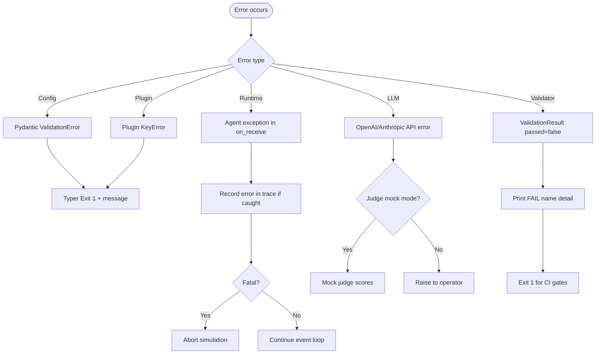
```mermaid
flowchart TD
    Start([Error occurs]) --> Classify{Error type}
    Classify -->|Config| PydanticErr[Pydantic ValidationError]
    Classify -->|Plugin| KeyError[Plugin KeyError]
    Classify -->|Runtime| AgentExc[Agent exception in on_receive]
    Classify -->|Validator| FailResult[ValidationResult passed=false]
    Classify -->|LLM| APIErr[OpenAI/Anthropic API error]
    PydanticErr --> CLIErr[Typer Exit 1 + message]
    KeyError --> CLIErr
    AgentExc --> TraceErr[Record error in trace if caught]
    TraceErr --> ContinueSim{Fatal?}
    ContinueSim -->|Yes| AbortRun[Abort simulation]
    ContinueSim -->|No| NextEvent[Continue event loop]
    FailResult --> ReportFail[Print FAIL name detail]
    APIErr --> MockFallback{Judge mock mode?}
    MockFallback -->|Yes| DeterministicMock[Mock judge scores]
    MockFallback -->|No| RaiseErr[Raise to operator]
    ReportFail --> Exit1[Exit 1 for CI gates]
```

## 2.4 Sequence Diagrams

### Sequence 1: Plugin Resolution (adapted from "login")

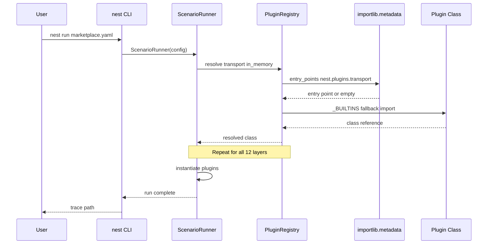
```mermaid
sequenceDiagram
    participant User
    participant CLI as nest CLI
    participant Runner as ScenarioRunner
    participant Reg as PluginRegistry
    participant EP as importlib.metadata
    participant Plugin as Plugin Class

    User->>CLI: nest run marketplace.yaml
    CLI->>Runner: ScenarioRunner(config)
    Runner->>Reg: resolve transport in_memory
    Reg->>EP: entry_points nest.plugins.transport
    EP-->>Reg: entry point or empty
    Reg->>Plugin: _BUILTINS fallback import
    Plugin-->>Reg: class reference
    Reg-->>Runner: resolved class
    Note over Runner,Reg: Repeat for all 12 layers
    Runner->>Runner: instantiate plugins
    Runner-->>CLI: run complete
    CLI-->>User: trace path
```

### Sequence 2: Primary Business Transaction (Marketplace Buy)

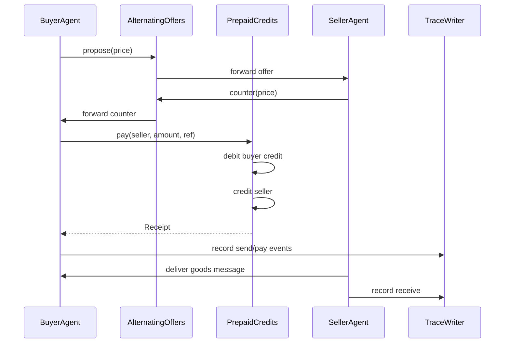
```mermaid
sequenceDiagram
    participant Buyer as BuyerAgent
    participant Neg as AlternatingOffers
    participant Pay as PrepaidCredits
    participant Seller as SellerAgent
    participant Trace as TraceWriter

    Buyer->>Neg: propose(price)
    Neg->>Seller: forward offer
    Seller->>Neg: counter(price)
    Neg->>Buyer: forward counter
    Buyer->>Pay: pay(seller, amount, ref)
    Pay->>Pay: debit buyer credit
    Pay->>Pay: credit seller
    Pay-->>Buyer: Receipt
    Buyer->>Trace: record send/pay events
    Seller->>Buyer: deliver goods message
    Seller->>Trace: record receive
```

### Sequence 3: Notification Handling (Trace Validation Webhook-style)

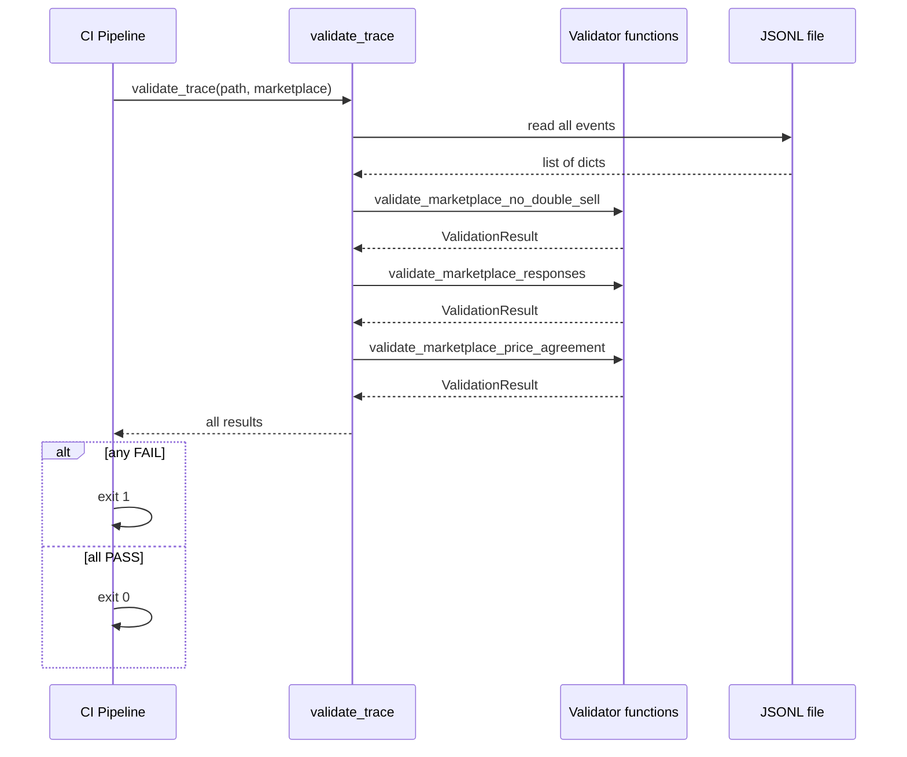
```mermaid
sequenceDiagram
    participant CI as CI Pipeline
    participant Py as validate_trace
    participant Val as Validator functions
    participant Trace as JSONL file

    CI->>Py: validate_trace(path, marketplace)
    Py->>Trace: read all events
    Trace-->>Py: list of dicts
    Py->>Val: validate_marketplace_no_double_sell
    Val-->>Py: ValidationResult
    Py->>Val: validate_marketplace_responses
    Val-->>Py: ValidationResult
    Py->>Val: validate_marketplace_price_agreement
    Val-->>Py: ValidationResult
    Py-->>CI: all results
    alt any FAIL
        CI->>CI: exit 1
    else all PASS
        CI->>CI: exit 0
    end
```

### Sequence 4: Admin Approval Workflow (Hackathon PR Judge)

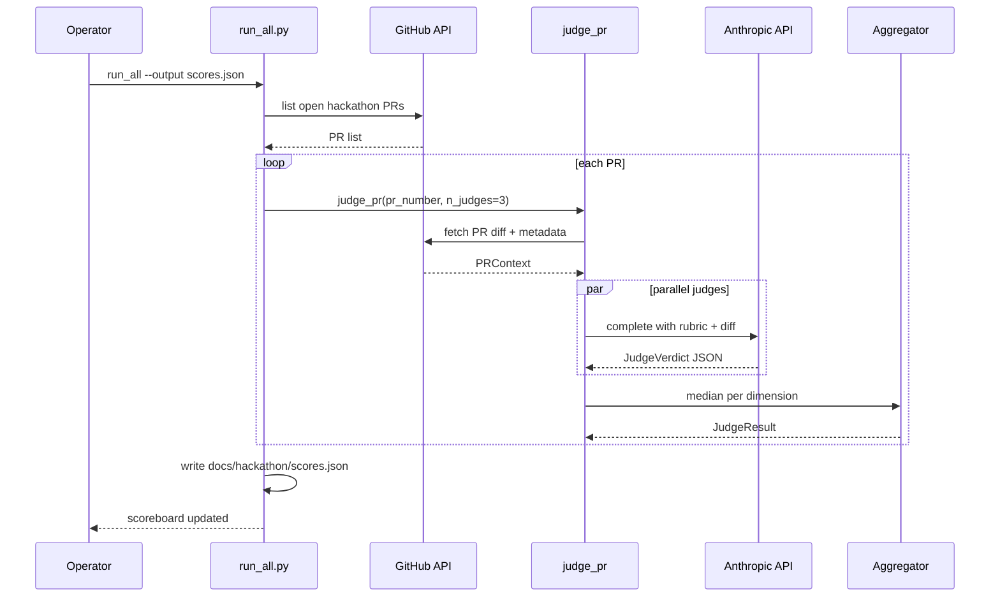
```mermaid
sequenceDiagram
    participant Op as Operator
    participant RunAll as run_all.py
    participant GH as GitHub API
    participant Judge as judge_pr
    participant Anthropic as Anthropic API
    participant Agg as Aggregator

    Op->>RunAll: run_all --output scores.json
    RunAll->>GH: list open hackathon PRs
    GH-->>RunAll: PR list
    loop each PR
        RunAll->>Judge: judge_pr(pr_number, n_judges=3)
        Judge->>GH: fetch PR diff + metadata
        GH-->>Judge: PRContext
        par parallel judges
            Judge->>Anthropic: complete with rubric + diff
            Anthropic-->>Judge: JudgeVerdict JSON
        end
        Judge->>Agg: median per dimension
        Agg-->>Judge: JudgeResult
    end
    RunAll->>RunAll: write docs/hackathon/scores.json
    RunAll-->>Op: scoreboard updated
```

---

# 7. C4 Architecture Documentation (Phase 3)

## 3.1 C4 System Context Diagram

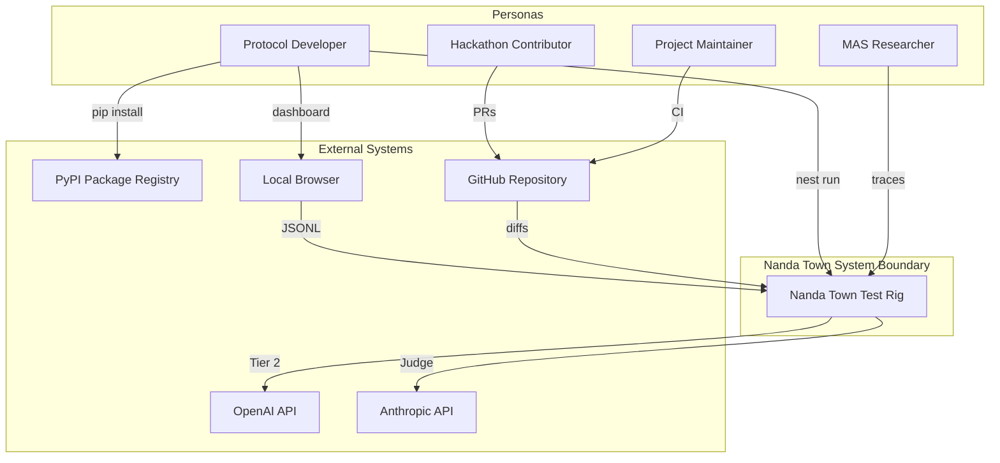
```mermaid
flowchart TB
    subgraph personas [Personas]
        ProtocolDev[Protocol Developer]
        Researcher[MAS Researcher]
        HackathonContributor[Hackathon Contributor]
        Maintainer[Project Maintainer]
    end

    subgraph boundary [Nanda Town System Boundary]
        NT[Nanda Town Test Rig]
    end

    subgraph external [External Systems]
        PyPI[PyPI Package Registry]
        GitHub[GitHub Repository]
        OpenAI[OpenAI API]
        Anthropic[Anthropic API]
        Browser[Local Browser]
    end

    ProtocolDev -->|pip install| PyPI
    ProtocolDev -->|nest run| NT
    Researcher -->|traces| NT
    HackathonContributor -->|PRs| GitHub
    Maintainer -->|CI| GitHub
    NT -->|Tier 2| OpenAI
    NT -->|Judge| Anthropic
    ProtocolDev -->|dashboard| Browser
    Browser -->|JSONL| NT
    GitHub -->|diffs| NT
```

## 3.2 C4 Container Diagram

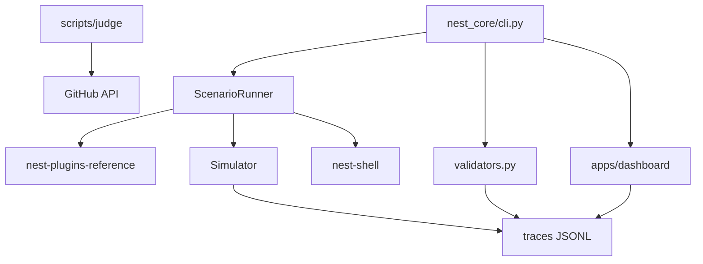
```mermaid
flowchart TB
    NestCLI[nest_core/cli.py]
    Runner[ScenarioRunner]
    Simulator[Simulator]
    Validators[validators.py]
    RefPlugins[nest-plugins-reference]
    ShellAgent[nest-shell]
    JudgePR[scripts/judge]
    DashboardHTML[apps/dashboard]
    JSONL[traces JSONL]

    NestCLI --> Runner
    Runner --> RefPlugins
    Runner --> Simulator
    Runner --> ShellAgent
    Simulator --> JSONL
    NestCLI --> Validators
    Validators --> JSONL
    NestCLI --> DashboardHTML
    DashboardHTML --> JSONL
    JudgePR --> GitHubExt[GitHub API]
```

## 3.3 C4 Component Diagram

[OBSERVED] Internal structure of `nest-core` and adjacent packages at component granularity.

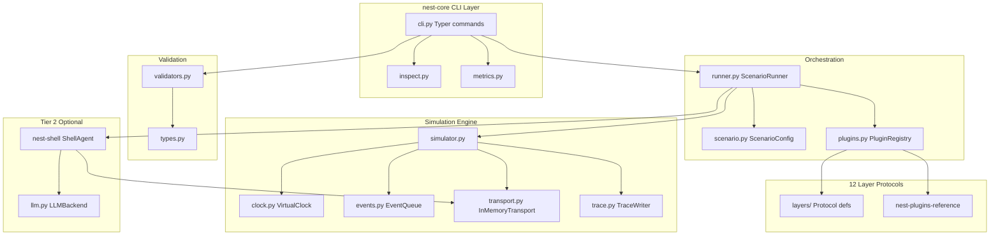
```mermaid
flowchart TB
    subgraph cli_pkg [nest-core CLI Layer]
        CLI[cli.py Typer commands]
        Inspect[inspect.py]
        Metrics[metrics.py]
    end

    subgraph orchestration [Orchestration]
        Runner[runner.py ScenarioRunner]
        Scenario[scenario.py ScenarioConfig]
        Plugins[plugins.py PluginRegistry]
    end

    subgraph sim_engine [Simulation Engine]
        Simulator[simulator.py]
        Clock[clock.py VirtualClock]
        Queue[events.py EventQueue]
        Transport[transport.py InMemoryTransport]
        TraceW[trace.py TraceWriter]
    end

    subgraph validation [Validation]
        Validators[validators.py]
        Types[types.py]
    end

    subgraph layers_pkg [12 Layer Protocols]
        LayerIfaces[layers/ Protocol defs]
        RefPlug[nest-plugins-reference]
    end

    subgraph tier2 [Tier 2 Optional]
        Shell[nest-shell ShellAgent]
        LLM[llm.py LLMBackend]
    end

    CLI --> Runner
    CLI --> Inspect
    CLI --> Metrics
    CLI --> Validators
    Runner --> Scenario
    Runner --> Plugins
    Runner --> Simulator
    Runner --> Shell
    Plugins --> LayerIfaces
    Plugins --> RefPlug
    Simulator --> Clock
    Simulator --> Queue
    Simulator --> Transport
    Simulator --> TraceW
    Validators --> Types
    Shell --> LLM
    Shell --> Transport
```

| Component | Responsibility | Interfaces | Dependencies | Notes |
|-----------|---------------|------------|--------------|-------|
| cli.py | User commands | Typer CLI | runner, validators | Entry `nest` |
| runner.py | Orchestration | ScenarioRunner.run | plugins, simulator | Shell branch |
| simulator.py | Event loop | Simulator.run | clock, trace | Tier 1 |
| plugins.py | Discovery | PluginRegistry.resolve | entry_points | 12 layers |
| scenario.py | YAML config | ScenarioConfig | pydantic | Validation |
| validators.py | Property checks | validate_trace | JSONL | 30+ checks |
| types.py | Domain models | Pydantic | pydantic | Shared types |
| nest_shell/llm.py | LLM abstraction | LLMBackend | openai, anthropic | Mock tests |
| judge_pr.py | PR scoring | judge_pr async | anthropic | 5000 line cap |

## 3.4 Deployment Diagram

[OBSERVED] Developer laptop + GitHub Actions CI + PyPI publish. `.railwayignore` present for optional static hosting. No K8s/Terraform.

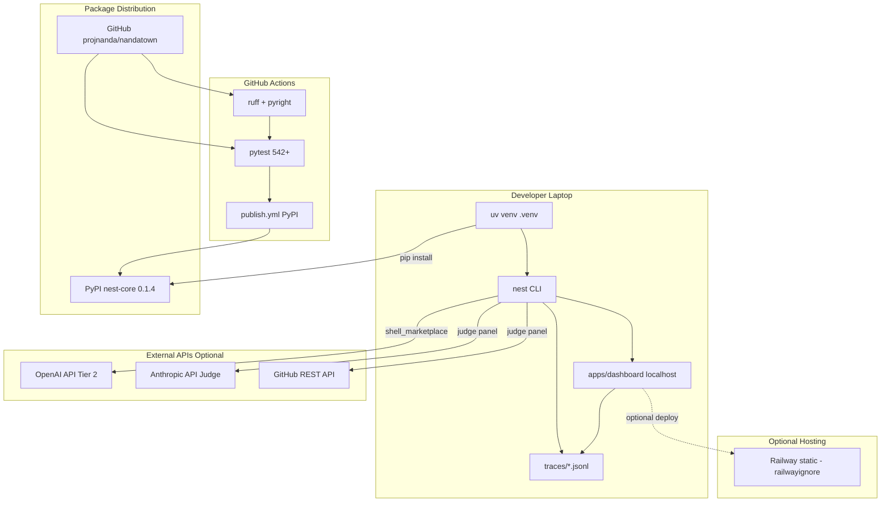
```mermaid
flowchart TB
    subgraph dev [Developer Laptop]
        DevEnv[uv venv .venv]
        NestCLI[nest CLI]
        Traces[traces/*.jsonl]
        Dash[apps/dashboard localhost]
    end

    subgraph cicd [GitHub Actions]
        LintJob[ruff + pyright]
        TestJob[pytest 542+]
        PublishJob[publish.yml PyPI]
    end

    subgraph registry [Package Distribution]
        PyPI[PyPI nest-core 0.1.4]
        GHRepo[GitHub projnanda/nandatown]
    end

    subgraph external_apis [External APIs Optional]
        OpenAI[OpenAI API Tier 2]
        Anthropic[Anthropic API Judge]
        GitHubAPI[GitHub REST API]
    end

    subgraph optional_host [Optional Hosting]
        Railway[Railway static - railwayignore]
    end

    DevEnv --> NestCLI
    NestCLI --> Traces
    NestCLI --> Dash
    Dash --> Traces
    GHRepo --> LintJob
    GHRepo --> TestJob
    LintJob --> TestJob
    TestJob --> PublishJob
    PublishJob --> PyPI
    DevEnv -->|pip install| PyPI
    NestCLI -->|shell_marketplace| OpenAI
    NestCLI -->|judge panel| Anthropic
    NestCLI -->|judge panel| GitHubAPI
    Dash -.->|optional deploy| Railway
```

## 3.5 Technology Stack Rationale

| Layer | Technology | Version | Rationale |
|-------|------------|---------|-----------|
| Language | Python | >=3.12 | MAS research ecosystem |
| Package mgr | uv | latest | Workspace monorepo |
| CLI | Typer | >=0.12 | Typed commands |
| Validation | Pydantic | >=2.0 | Scenario + types |
| Testing | pytest+hypothesis | 9.x/6.x | Property tests |
| LLM | openai, anthropic | 2.x/0.x | Tier 2 + judge |
| Crypto | cryptography | >=42 | ed25519 plugin |

## 3.6 Multi-Cloud Service Mapping

[MISSING] Production cloud deployment. [OBSERVED] GitHub Actions + PyPI only.

## 3.7 Module Breakdown

| Module | Key Files | Inputs | Outputs |
|--------|-----------|--------|---------|
| nest-core | simulator.py, cli.py | YAML | JSONL |
| nest-sdk | __init__.py | N/A | Re-exports |
| nest-plugins-reference | */plugins | Layer calls | Behavior |
| nest-shell | llm.py, agent.py | Prompts | Actions |
| scripts/judge | judge_pr.py | GitHub PR | scores.json |

## 3.8 Architecture Decision Records

**ADR-001 12-Layer Decomposition** — Protocol per layer, plugin per implementation. Alternatives: monolith. Risk: boundary overlap.

**ADR-002 Structural Typing** — No inheritance required. Alternatives: ABC. Risk: runtime signature mismatch.

**ADR-003 JSONL Traces** — Grep-able audit log. Alternatives: OTel, SQLite. Risk: large files.

**ADR-004 Seeded Determinism** — Master seed drives all RNGs. Alternatives: wall clock. Risk: zero default latency.

**ADR-005 Entry-Point Discovery** — `nest.plugins.<layer>` groups. Alternatives: manifest file. Risk: name collisions.

## 3.9 Failure Mode and Resilience Notes

| Component | SPOF | Degraded Mode | Chaos Test |
|-----------|------|---------------|------------|
| Simulator | Single process | Hard fail | message_drop |
| PluginRegistry | Import | KeyError | missing plugin test |
| LLM Backend | API outage | Mock fallback | judge mock mode |
| TraceWriter | Disk full | Abort | [MISSING] |

## 3.10 Disaster Recovery

RPO/RTO: N/A — stateless runs. Traces user-managed.

## 3.11 Sustainability Architecture

| Component | Concern | Optimization |
|-----------|---------|--------------|
| 10K agent sweeps | CPU | Reduce ticks, profile |
| LLM Tier 2 | API energy | Mock for dev |
| Judge panel | Opus cost | Rubric prompt caching |

---

# 8. Data Model and Data Lineage (Phase 4)

## 4.1 Core Entity Specification (Selected)

| Entity | Field | Type | Nullable | Description |
|--------|-------|------|----------|-------------|
| AgentId | value | str | No | Agent identifier |
| Message | sender/receiver | AgentId | No | Routing |
| Message | payload | bytes | No | Opaque content |
| Money | amount | float | No | Credit value |
| Token | value | str | No | Sim JWT |
| TraceEvent | ts | float | No | Logical time |
| TraceEvent | kind | str | No | start/send/receive/stop |
| ScenarioConfig | seed | int | No | RNG seed |

## 4.2 Relationship Model

Agent 1:N Message; Agent 1:1 AgentCard; ScenarioRun 1:1 Trace; Trace 1:N TraceEvent.

## 4.3 ER Diagram

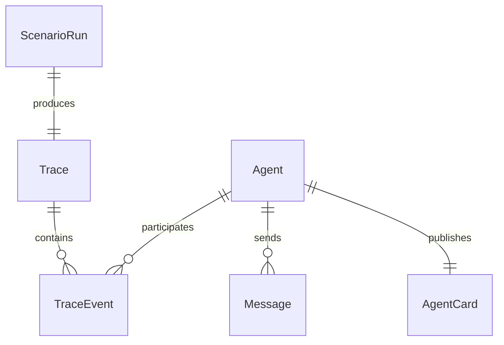
```mermaid
erDiagram
    Agent ||--o{ Message : sends
    Agent ||--|| AgentCard : publishes
    ScenarioRun ||--|| Trace : produces
    Trace ||--o{ TraceEvent : contains
    Agent ||--o{ TraceEvent : participates
```

## 4.4 Data Lifecycle Rules

Simulation state: in-memory, cleared on exit. Traces: user-retained JSONL. scores.json: git-committed for hackathon.

## 4.5 Query and Index Strategy

JSONL: linear scan, grep/jq. In-memory registry: dict by agent_id.

## 4.6 Data Lineage Mapping

| Element | Source | Destination | Owner |
|---------|--------|-------------|-------|
| Trace events | ctx.send/receive | JSONL | nest-core |
| Validation | Trace | CLI/CI | validators |
| Judge scores | GitHub PR | scores.json | judge |

---

# 9. Dependency and Library Documentation (Phase 5)

## 5.1 Workspace Root (`pyproject.toml`)

[OBSERVED] Workspace package `nest-workspace` v0.1.0 — Apache 2.0, Python >=3.12, Alpha.

| Dependency | Constraint | Architectural Layer | Criticality | License |
|------------|------------|---------------------|-------------|---------|
| nest-core | workspace | Sim engine / CLI | Critical | Apache-2.0 |
| nest-sdk | workspace | Public API | Critical | Apache-2.0 |
| nest-mocks | workspace | Testing | Medium | Apache-2.0 |
| nest-scenarios | workspace | Scenario fixtures | Medium | Apache-2.0 |
| nest-shell | workspace | AI / Tier 2 | Medium | Apache-2.0 |
| nest-plugins-reference | workspace | Default plugins | High | Apache-2.0 |
| nest-marketplace | workspace | Hackathon UI data | Low | Apache-2.0 |

**Optional extras (root):**

| Extra | Dependencies | Layer | Notes |
|-------|--------------|-------|-------|
| judge | anthropic>=0.30, openai>=1.0 | AI / hackathon | `uv sync --extra judge` |
| harness | matplotlib>=3.8, PyYAML>=6.0 | Research automation | Optional plotting |
| plugins | cryptography>=42.0 | Security plugins | Documents crypto requirement |

**Dev dependencies (root):**

| Dependency | Constraint | Layer | Criticality |
|------------|------------|-------|-------------|
| pytest | >=8.0 | Dev / QA | High |
| pytest-asyncio | >=0.24 | Dev / QA | High |
| hypothesis | >=6.100 | Dev / QA | High |
| ruff | >=0.4 | Dev tooling | High |
| pyright | >=1.1.400,<1.1.410 | Dev tooling | High |
| nest-cli | workspace | Deprecated shim | Low |

## 5.2 Package: `nest-core` (v0.1.4)

| Dependency | Constraint | Layer | Criticality | License |
|------------|------------|-------|-------------|---------|
| pydantic | >=2.0 | Validation / types | Critical | MIT |
| pyyaml | >=6.0 | Config parsing | High | MIT |
| typer | >=0.12 | CLI / UI | High | MIT |

| Optional Extra | Dependencies | Layer |
|----------------|--------------|-------|
| plugins | nest-plugins-reference>=0.1.1 | Reference stack |
| llm | nest-shell>=0.1.0 | AI Tier 2 |
| full | plugins + llm | Combined |

[OBSERVED] Console script: `nest = nest_core.cli:app`

## 5.3 Package: `nest-sdk` (v0.1.0)

| Dependency | Constraint | Layer | Criticality |
|------------|------------|-------|-------------|
| nest-core | workspace | Core types | Critical |

[OBSERVED] Zero third-party runtime deps beyond workspace — thin public API re-export layer.

## 5.4 Package: `nest-shell` (v0.1.0)

| Dependency | Constraint | Layer | Criticality |
|------------|------------|-------|-------------|
| nest-core | workspace | Sim integration | Critical |
| nest-sdk | workspace | Protocol types | Critical |
| openai | >=1.0 | AI inference | Medium |

| Optional Extra | Dependencies | Layer |
|----------------|--------------|-------|
| anthropic | anthropic>=0.30 | AI inference | |
| litellm | litellm>=1.0 | AI abstraction | |
| all | anthropic + litellm | Combined | |

## 5.5 Package: `nest-plugins-reference` (v0.1.1)

| Dependency | Constraint | Layer | Criticality | Notes |
|------------|------------|-------|-------------|-------|
| nest-core | workspace | Layer contracts | Critical | |
| nest-sdk | workspace | Protocol types | Critical | |
| cryptography | >=42.0 | Security / ed25519 | Medium | [RISK] Real crypto for ed25519_rotating only |

[OBSERVED] Entry point: `nest.plugins.memory` → `lww_register`

## 5.6 Package: `nest-marketplace` (v0.1.0)

| Dependency | Constraint | Layer | Criticality |
|------------|------------|-------|-------------|
| *(none)* | — | Hackathon static JSON | Low |

[OBSERVED] Script: `nest-marketplace-build = nest_marketplace.build_data:main`

## 5.7 Package: `nest-scenarios` (v0.1.0)

| Dependency | Constraint | Layer | Criticality |
|------------|------------|-------|-------------|
| nest-core | workspace | Scenario loading | Medium |

## 5.8 Package: `nest-mocks` (v0.1.0)

| Dependency | Constraint | Layer | Criticality |
|------------|------------|-------|-------------|
| nest-core | workspace | Test doubles | Medium |

## 5.9 Package: `nest-cli` (v0.1.1) [DEPRECATED]

| Dependency | Constraint | Layer | Criticality | Notes |
|------------|------------|-------|-------------|-------|
| nest-core | >=0.1.2 | Shim | Low | [DEPRECATED] No console script |

| Optional Extra | Dependencies |
|----------------|--------------|
| llm | nest-core[llm]>=0.1.2 |

## 5.10 Resolved Runtime Inventory (uv lock)

[OBSERVED] Key third-party packages resolved in local `.venv` after `uv sync`:

| Package | Version | Layer | Criticality |
|---------|---------|-------|-------------|
| nest-core | 0.1.4 | Core | Critical |
| nest-sdk | 0.1.0 | SDK | Critical |
| nest-plugins-reference | 0.1.1 | Plugins | High |
| nest-shell | 0.1.0 | AI | Medium |
| pydantic | 2.13.4 | Validation | Critical |
| typer | 0.26.7 | CLI | High |
| cryptography | 49.0.0 | Security | Medium |
| openai | 2.43.0 | AI | Medium |
| anthropic | 0.111.0 | AI | Medium |
| pytest | 9.1.1 | Test | High |
| hypothesis | 6.155.7 | Test | High |

## 5.11 Layer Groupings (Cross-Package)

| Layer | Packages / Dependencies | Role |
|-------|------------------------|------|
| UI / CLI | typer, rich (via nest-core) | User interaction |
| Sim engine | nest-core, pydantic, pyyaml | Event loop, scenarios |
| Auth plugins | nest-plugins-reference, cryptography | Layer implementations |
| AI / LLM | nest-shell, openai, anthropic | Tier 2 + judge |
| Testing | pytest, hypothesis, nest-mocks | QA |
| Dev tooling | ruff, pyright | CI gates |
| Hackathon | nest-marketplace, scripts/judge | Community ops |

## 5.12 Version Compatibility

Python >=3.12 required; pyright pinned <1.1.410 for Typer compatibility.

## 5.13 Dependency Risks

Alpha 0.1.x APIs; LLM vendor lock-in mitigated by LLMBackend protocol and mock.

## 5.14 Setup Instructions

```powershell
git clone https://github.com/projnanda/nandatown.git
cd nandatown; uv sync
uv run nest doctor
uv run nest run marketplace
uv run pytest -v
```

## 5.15 AI Package Mapping

openai/anthropic: inference. nest-shell: orchestration. scripts/judge: evaluation. scripts/harness: automation sweeps.

---

# 10. Security and Zero Trust Documentation (Phase 6)

## Red Team Findings (Adversarial Pass)

| Attack Vector | Surface | Exploit | Impact | Status |
|---------------|---------|---------|--------|--------|
| Forged sim JWT | `JwtAuth` default secret `b"nest-default-secret"` | HMAC with known secret | Bypass simulated auth | [RISK] Documented non-production |
| Token replay | In-memory `_revoked` set only | Reuse before revoke | Scope escalation in sim | Mitigated by revoke API |
| Byzantine agents | `byzantine_fraction` config | Garbled messages | Protocol stress test | By design |
| PR prompt injection | Judge panel diff input | Malicious PR body | LLM manipulation | [RISK] Partial — diff truncated |
| API key exfiltration | Env vars OPENAI/ANTHROPIC | CI log leakage | Cost/abuse | [MISSING] formal secret scanning |
| Privacy bypass | `NoopPrivacy` | Passthrough | No encryption | By design for testing |
| Sybil agents | `score_average` trust | Unlimited agent ids | Reputation gaming | [OBSERVED] No Sybil resistance in default |

## Blue Team Controls (Defensive Pass)

| Control | Implementation | Verification |
|---------|---------------|--------------|
| Input validation | Pydantic ScenarioConfig | pytest test_scenario.py |
| Token signature verify | HMAC compare in JwtAuth | test_layers.py |
| Token revocation | `_revoked` set | unit tests |
| Determinism enforcement | Seeded RNG | test_properties.py, hypothesis |
| Type safety | pyright strict mode | CI pyright job |
| Dependency hygiene | uv lock, ruff | CI lint job |
| Live test isolation | `@pytest.mark.live` skipped default | pytest -m "not live" |
| Judge mock fallback | Deterministic mock without API key | test_judge.py |
| Diff size cap | MAX_FILE_DIFF_LINES=5000 | judge_pr.py |

## 6.1 Authentication Design

| Method | Implementation | Token Lifecycle | Storage | Notes |
|--------|---------------|-----------------|---------|-------|
| Sim JWT | `JwtAuth` HMAC-SHA256 | iat/exp 3600s | In-memory `_revoked` | NOT RFC 7519 |
| Capability tokens | `auth.issue(scopes)` | Revocable | Agent-held | Simulation only |
| LLM API keys | Env vars | Provider-managed | OS env | No vault integration |
| GitHub API | urllib for judge | Per-request | [MISSING] token in judge | Public repo reads |

No OAuth2/OIDC/MFA — [MISSING] not applicable to CLI test rig.

## 6.2 Authorization Matrix

| Role | Resource | Create | Read | Update | Delete | Approve | Export |
|------|----------|--------|------|--------|--------|---------|--------|
| Protocol Dev | Plugin | Yes (entry point) | Yes | Yes | Yes | N/A | pip package |
| Protocol Dev | Scenario YAML | Yes | Yes | Yes | Yes | N/A | File |
| Protocol Dev | Trace | Via run | Yes | N/A | Yes | N/A | JSONL |
| Maintainer | PyPI package | CI publish | Yes | Release | N/A | N/A | wheel |
| Judge Operator | PR scores | run_all | Yes | Regenerate | N/A | N/A | scores.json |
| Sim Agent | Token scopes | Via auth.issue | verify only | N/A | revoke | N/A | N/A |

## 6.3 Security Controls

| Control | Implementation | Verification |
|---------|---------------|--------------|
| Password hashing | N/A | N/A |
| Token security | HMAC-SHA256 hex sig | unit tests |
| Secret management | Env vars only | [MISSING] vault |
| CSRF | N/A (no web app) | N/A |
| XSS | Dashboard local HTML | [INFERRED] sanitize if hosting public |
| CORS | Local dashboard server | [MISSING] policy |
| Rate limiting | None on CLI | N/A |
| Input validation | Pydantic | CI tests |
| Audit logging | JSONL trace | validate_trace |

## 6.4 Data Protection

| State | Protection | Key Management |
|-------|------------|----------------|
| In transit (sim) | None — in-process | N/A |
| In transit (LLM) | HTTPS (SDK default) | Provider-managed |
| At rest (trace) | None by default | User filesystem |
| PII | Synthetic agent ids | N/A |
| Backup encryption | [MISSING] | User responsibility |

## 6.5 Zero Trust Architecture

| Layer | Control | Implementation |
|-------|---------|----------------|
| Identity | AgentId per agent | Assigned at creation |
| AuthZ | Scoped tokens | JwtAuth scopes list |
| Transport | In-memory only | No network attack surface in Tier 1 |
| LLM boundary | API key required | Env var check before call |
| Supply chain | PyPI publish | GitHub Actions + token |

[INFERRED STRATEGY BASED ON MARKET STANDARD:] For production protocol deployment, replace all reference plugins and add mTLS between agents.

## 6.6 Compliance Mapping

| Standard | Requirement | Implementation | Evidence |
|----------|-------------|----------------|----------|
| GDPR | PII handling | Synthetic data only | README scope |
| SOC 2 | Controls | [MISSING] | N/A |
| ISO 27001 | ISMS | [MISSING] | N/A |
| PCI DSS | Payments | Sim prepaid credits only | Not applicable |
| NIST AI RMF | AI governance | Partial — judge rubric | Section 12 |

## 6.7 Threat Model Summary

| Threat | Surface | Likelihood | Impact | Mitigation |
|--------|---------|------------|--------|------------|
| Misuse of reference plugins in prod | pip install defaults | Medium | High | Documentation, warnings |
| Non-deterministic benchmark | Tier 2 shell | High if misused | Medium | README warning |
| Judge API cost attack | Malicious PR volume | Low | Medium | Rate limits [MISSING] |
| Trace data leak | Committed traces | Low | Low | .gitignore traces |

---

# 11. API Documentation (Phase 7)

[OBSERVED] **No REST/HTTP API.** Primary interfaces: **CLI** (`nest`), **Python SDK** (`nest_sdk`, `nest_core.validators`), and **YAML scenario files**.

## 7.1 Critical Interface Specifications

### CLI: `nest run`

| Field | Value |
|-------|-------|
| Path | `nest run <scenario> [-o output] [--seed N]` |
| Method | Typer command (in-process) |
| Auth | None |
| Input | Built-in name or path to `.yaml` |
| Output | JSONL trace path |
| Validation | Pydantic ScenarioConfig |
| Success | Exit 0, trace written |
| Errors | Exit 1: invalid config, plugin KeyError, run failure |

### Python: `validate_trace`

| Field | Value |
|-------|-------|
| Path | `nest_core.validators.validate_trace(path, scenario_name)` |
| Auth | N/A |
| Input | `Path` to JSONL, scenario name string |
| Output | `list[ValidationResult]` with `passed`, `name`, `detail` |
| Success | All `passed=True` |
| Errors | FileNotFoundError, unknown scenario |

### Python: `PluginRegistry.resolve`

| Field | Value |
|-------|-------|
| Path | `PluginRegistry().resolve(layer, name)` |
| Input | layer: one of 12 strings; name: plugin name |
| Output | Plugin class |
| Errors | `KeyError` if not found |

## 7.2 Endpoint Catalog (CLI Commands)

| Command | Purpose | Auth | Dependencies |
|---------|---------|------|--------------|
| `nest run` | Execute scenario | No | runner, simulator |
| `nest doctor` | Health checks | No | all packages |
| `nest inspect` | Trace summary | No | JSONL file |
| `nest report` | HTML metrics | No | metrics.py |
| `nest dashboard` | Visual UI | No | apps/dashboard |
| `nest init` | Plugin scaffold | No | templates |
| `nest scenarios list/show/cp` | Scenario mgmt | No | builtin yaml |
| `nest plugins list` | Plugin discovery | No | PluginRegistry |
| `nest templates *` | Shell templates | No | nest-shell |
| `nest version` | Version info | No | importlib.metadata |

## 7.3 Integration Inventory

| External System | Purpose | Auth | Failure Handling | Retry |
|-----------------|---------|------|------------------|-------|
| PyPI | Package distribution | API token in CI | skip-existing publish | Manual re-release |
| GitHub API | Judge PR fetch | [MISSING] explicit token | urllib error | Fail PR judge |
| OpenAI API | Tier 2 agents | OPENAI_API_KEY | SDK exception | [MISSING] |
| Anthropic API | Tier 2 + judge | ANTHROPIC_API_KEY | Mock fallback in judge | Parallel judges |

## 7.4 Contract Risk Analysis

| Risk | Mitigation |
|------|------------|
| Breaking CLI changes | Semver on nest-core |
| YAML schema changes | Pydantic validation errors |
| Plugin interface changes | nest-sdk version coupling |
| Trace format drift | [MISSING] schema version field |
| Idempotency | Same seed → identical trace [OBSERVED] |

---

# 12. AI / LLM / Agentic Architecture (Phase 11)

[OBSERVED] **AI subsystems exist** — Tier 2 ShellAgent, hackathon judge panel, research harness.

## 11.1 AI Capability Inventory

| ID | Capability | Business Purpose | Trigger | Input | Output | Model | Human Review | Risk | NIST RMF |
|----|------------|------------------|---------|-------|--------|-------|--------------|------|----------|
| AI-001 | ShellAgent marketplace | Emergent LLM trading behavior | shell_marketplace scenario | Agent prompts + state | Buy/sell actions | gpt-4o-mini / claude | No | Non-determinism | MAP-1.5 |
| AI-002 | ShellAgent auction | LLM bidding | shell scenario | Prompts | Bids | Configurable | No | Cost | MAP-1.5 |
| AI-003 | Judge panel | Hackathon PR scoring | run_all.py | PR diff + rubric | 6-dim scores 1-5 | Claude Opus | PR merge human | Prompt injection | MAP-2.0 |
| AI-004 | Mock LLM | CI/testing | Test / no API key | Messages | Deterministic text | mock | N/A | Low | N/A |
| AI-005 | Harness agent_runner | Research sweeps | run_condition.py | Brief + conditions | Experiment results | [varies] | Researcher | Cost | MAP-1.1 |

## 11.2 AI System Classification

| Type | Classification | Problem Solved | Boundary |
|------|--------------|----------------|----------|
| ShellAgent | Tool-using agent (simulated) | Emergent protocol behavior | Single scenario run |
| Judge panel | Multi-judge evaluator | OSS contribution quality | Hackathon PRs only |
| Harness | Workflow automation AI | Research condition matrix | scripts/harness |

## 11.3 AI Structural Blueprint

| Layer | Responsibility | Components | Inputs | Outputs |
|-------|---------------|------------|--------|---------|
| Experience | CLI/scenario trigger | nest run shell_* | YAML config | Agent loop |
| Orchestration | Agent factory selection | runner._create_shell_agents | brain=shell | ShellAgent instances |
| Context | Prompt templates | nest_shell templates | Role + state | LLM messages |
| Model | Inference | OpenAIBackend, AnthropicBackend | Messages | Text response |
| Tool | Protocol layer calls | Payments, Negotiation, etc. | Parsed LLM output | Layer operations |
| Validation | Property validators | validators.py | Trace | PASS/FAIL |
| Delivery | Trace + report | TraceWriter, metrics | Events | JSONL/HTML |

## 11.4 AI Workflow Orchestration

| Step | Stage | Component | Sync/Async | Error Handling |
|------|-------|-----------|------------|----------------|
| 1 | Config load | ScenarioConfig | Sync | Pydantic ValidationError |
| 2 | Backend init | llm.py | Sync | ImportError if SDK missing |
| 3 | Agent tick | ShellAgent.on_receive | Async | Exception → trace error |
| 4 | LLM call | backend.complete | Async | SDK API error |
| 5 | Action parse | agent parser | Sync | Fallback action [INFERRED] |
| 6 | Trace record | TraceWriter | Sync | IO error |

## 11.5 AI Orchestration Pattern Review

| Pattern | Best Use | Strengths | Weaknesses | Recommendation |
|---------|----------|-----------|------------|----------------|
| Single-call LLM | Simple agent decisions | Low latency | No planning | Used in ShellAgent |
| RAG pipeline | [MISSING] | N/A | N/A | Not implemented |
| Tool-using agent | Protocol interaction | Realistic behavior | Parse failures | Current Tier 2 approach |
| Multi-step workflow | Judge panel | Robust scoring | 3× cost | Median aggregation |
| Multi-agent judges | PR evaluation | Reduced bias | API cost | [OBSERVED] default n=3 |
| Human-in-the-loop | PR merge | Quality gate | Slow | GitHub merge approval |

## 11.6 AI Workflow Diagrams

### AI Request Lifecycle (ShellAgent)

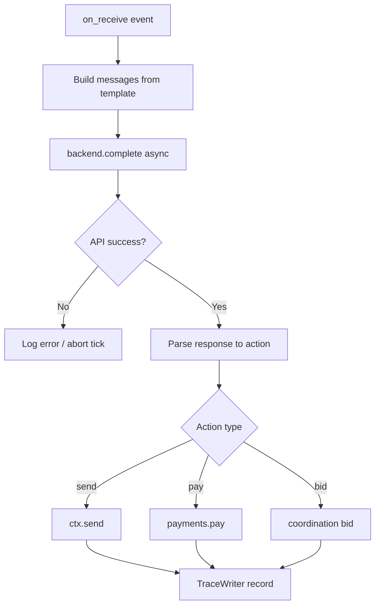
```mermaid
flowchart TD
    Event[on_receive event] --> BuildPrompt[Build messages from template]
    BuildPrompt --> LLMCall[backend.complete async]
    LLMCall --> APIOK{API success?}
    APIOK -->|No| Err[Log error / abort tick]
    APIOK -->|Yes| Parse[Parse response to action]
    Parse --> Action{Action type}
    Action -->|send| Send[ctx.send]
    Action -->|pay| Pay[payments.pay]
    Action -->|bid| Bid[coordination bid]
    Send --> Trace[TraceWriter record]
    Pay --> Trace
    Bid --> Trace
```

### Judge Orchestration

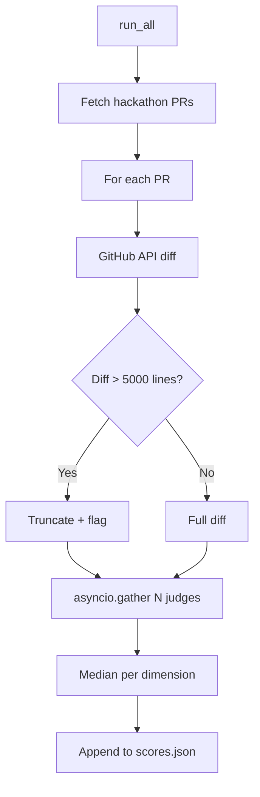
```mermaid
flowchart TD
    Start[run_all] --> ListPRs[Fetch hackathon PRs]
    ListPRs --> EachPR[For each PR]
    EachPR --> FetchDiff[GitHub API diff]
    FetchDiff --> Truncate{Diff > 5000 lines?}
    Truncate -->|Yes| Cap[Truncate + flag]
    Truncate -->|No| Full[Full diff]
    Cap --> Parallel[asyncio.gather N judges]
    Full --> Parallel
    Parallel --> Median[Median per dimension]
    Median --> Write[Append to scores.json]
```

### RAG Workflow

[OBSERVED: No RAG subsystem in current project materials]

[INFERRED STRATEGY BASED ON MARKET STANDARD:] Optional RAG over `docs/layers/` for plugin authoring assistant.

### Tool-Using Agent Flow

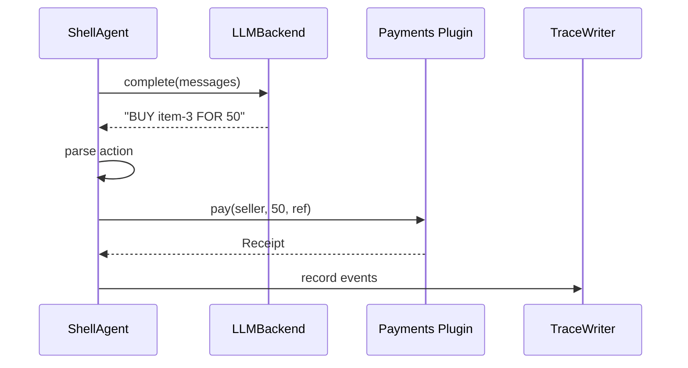
```mermaid
sequenceDiagram
    participant Agent as ShellAgent
    participant LLM as LLMBackend
    participant Pay as Payments Plugin
    participant Trace as TraceWriter

    Agent->>LLM: complete(messages)
    LLM-->>Agent: "BUY item-3 FOR 50"
    Agent->>Agent: parse action
    Agent->>Pay: pay(seller, 50, ref)
    Pay-->>Agent: Receipt
    Agent->>Trace: record events
```

### Automation Workflow (Harness)

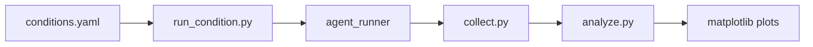
```mermaid
flowchart LR
    Cond[conditions.yaml] --> RunCond[run_condition.py]
    RunCond --> AgentRun[agent_runner]
    AgentRun --> Collect[collect.py]
    Collect --> Analyze[analyze.py]
    Analyze --> Plot[matplotlib plots]
```

### Parallel Judge Execution

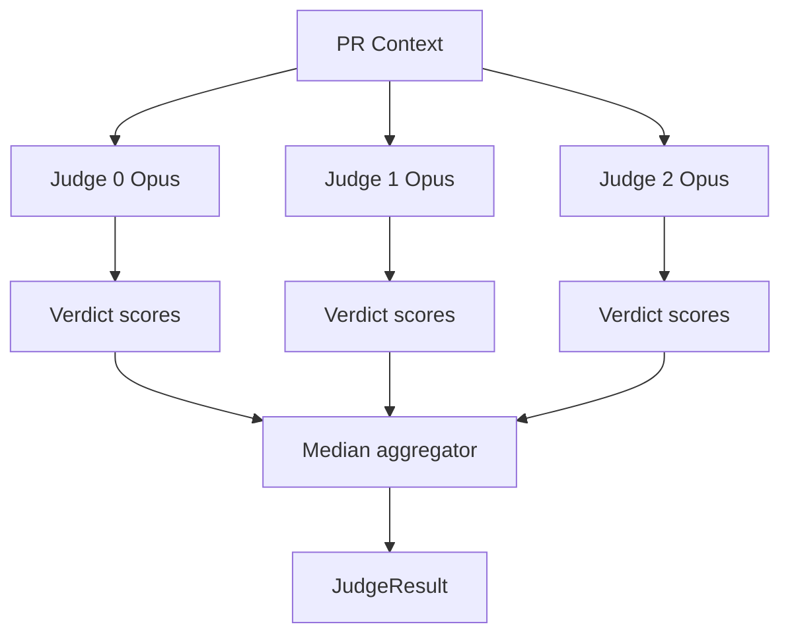
```mermaid
flowchart TD
    PR[PR Context] --> J0[Judge 0 Opus]
    PR --> J1[Judge 1 Opus]
    PR --> J2[Judge 2 Opus]
    J0 --> V0[Verdict scores]
    J1 --> V1[Verdict scores]
    J2 --> V2[Verdict scores]
    V0 --> Med[Median aggregator]
    V1 --> Med
    V2 --> Med
    Med --> Result[JudgeResult]
```

### Human Approval Loop

```mermaid
flowchart TD
    Submit[Contributor opens PR] --> CI[GitHub CI pytest]
    CI -->|pass| AutoJudge[Optional judge panel]
    AutoJudge --> Scores[scores.json updated]
    Scores --> HumanReview[Maintainer review]
    HumanReview -->|approve| Merge[Merge to main]
    HumanReview -->|reject| Close[Request changes]
```

## 11.7 Model Context Protocol Documentation

[OBSERVED: No MCP server implementation in repository]

| MCP Server | Tools | Use Case | Security |
|------------|-------|----------|----------|
| [MISSING] | [MISSING] | [INFERRED] nest run remote | [MISSING] |

## 11.8 Agent-to-Agent Protocol

| Capability | Implementation | Security | Governance |
|------------|---------------|----------|------------|
| Inter-agent messaging | CommsProtocol + Transport | In-process only | Scenario config |
| Coordination | contract_net | Simulated | Validators |
| Payments | prepaid_credits | In-memory ledger | Validators |

## 11.9 AI Orchestration Technology Matrix

| Technology | Category | Best For | Pros | Cons | Recommendation |
|------------|----------|----------|------|------|----------------|
| nest-shell | Custom orchestrator | Tier 2 sim | Integrated | Non-deterministic | Use for exploration only |
| scripts/judge | Custom batch | PR scoring | Idempotent | Cost | Keep for hackathon |
| LangGraph | Framework | Complex agents | [INFERRED] | Heavy dep | Not adopted |
| Temporal | Workflow engine | Long-running | [INFERRED] | Infrastructure | Not needed for sim |
| n8n | Low-code | Ops automation | [INFERRED] | External | Not adopted |

## 11.10 AI Evaluation Framework

| Metric | Definition | Threshold | Owner |
|--------|------------|-----------|-------|
| Correctness | Judge dimension / validators pass | >=4/5 or PASS | Automated |
| Hallucination rate | [MISSING formal] | N/A Tier 1 | N/A |
| Task success rate | Scenario completion | Validator PASS | validators.py |
| Latency | LLM round-trip | [MISSING] SLO | [MISSING] |
| Cost per task | API tokens per agent tick | [MISSING] budget | Operator |
| User satisfaction | [MISSING] | N/A | N/A |

## 11.11 Retrieval Architecture

[MISSING] No vector DB or embedding pipeline in repository.

## 11.12 AI Memory and Session State

| Memory Type | Scope | Retention | Reset | Risk |
|-------------|-------|-----------|-------|------|
| Agent state dict | Per agent per run | Run duration | New run | Low |
| LLM context | Per complete() call | Single turn | Next tick | Context loss |
| Judge rubric cache | Anthropic prompt cache | Session | [OBSERVED] caching | Stale rubric if updated |
| Blackboard memory | Shared KV plugin | Scenario duration | End run | Race conditions tested |

## 11.13 AI Automation Layer

| ID | Trigger | AI Decision | Task | Approval | Rollback | Audit |
|----|---------|-------------|------|----------|----------|-------|
| AUTO-001 | Hackathon PR open | Judge scores | run_all.py | Human merge | Re-run judge | scores.json |
| AUTO-002 | shell_marketplace | LLM trade action | payments.pay | No | N/A | JSONL trace |
| AUTO-003 | harness condition | Agent brief response | run_condition | Researcher | Re-run | harness output |

## 11.14 Parallel Output Decision Matrix

| Need | Pattern | Aggregation |
|------|---------|-------------|
| Fast response | Top-1 LLM output | First parseable action |
| Best PR score | 3 parallel judges | Median per dimension |
| Multi-step task | ShellAgent tick loop | Sequential merge |
| Sensitive actions | [MISSING] | Human approval for merge |

## 11.15 AI Output Modes

| Mode | Format | Consumer | Validation |
|------|--------|----------|------------|
| Trace events | JSONL | validators | Property checks |
| Judge verdict | JSON | scores.json | Schema in tests |
| HTML report | HTML | Browser | Manual |
| LLM text | String | ShellAgent parser | Action parse |

## 11.16 AI Guardrails

| Control | Purpose | Trigger | Action |
|---------|---------|---------|--------|
| max_tokens=256 | Cost/latency cap | LLM init | Truncate response |
| Diff truncation | Context limit | >5000 lines | Truncate diff |
| Mock fallback | CI without keys | No API key | Deterministic scores |
| Tier 2 README warning | Benchmark invalidity | shell scenario | Documentation |
| @pytest.mark.live | Isolate live API tests | pytest default | Skip |

## 11.17 AI Observability

| Telemetry | Purpose | Storage | Alert |
|-----------|---------|---------|-------|
| Trace events | Agent action audit | JSONL | Validator FAIL |
| Judge raw_response | Debug | JudgeVerdict object | error field |
| [OBSERVED] token counts | Cost tracking (shell + judge) | stderr (`NEST_LLM_TELEMETRY`) | [MISSING] |

## 11.18 AI Package Mapping

See Section 5.15.

## 11.19 AI Recommendation Summary

1. **Maturity:** Experimental Tier 2 + operational judge panel; no production AI governance framework.
2. **Architecture pattern:** Tool-using ShellAgent with protocol layer integration.
3. **Orchestration:** Custom in-process — no LangGraph/Temporal.
4. **Parallel strategy:** Median of 3 judges for PR scoring.
5. **Human-in-the-loop:** Required for PR merge; not for sim runs.
6. **Top 5 AI risks:** Non-determinism, API cost, prompt injection in judge, missing token budgets, no output schema enforcement on LLM text.
7. **Top 5 improvements:** Structured output (JSON mode), ~~token/cost telemetry~~ [OBSERVED], RAG over docs for plugin authors, formal eval harness for Tier 2, MCP tool exposure for `nest run`.

---

# 13. System Requirements Specification (Phase 8)

## 8.1 Functional Requirements

| ID | Requirement | Priority | Acceptance Criteria |
|----|-------------|----------|---------------------|
| FR-01 | Run built-in scenarios via CLI | Must | `nest run marketplace` writes JSONL |
| FR-02 | Load custom scenario YAML | Must | Pydantic validates; invalid YAML fails |
| FR-03 | Resolve plugins by name | Must | 12 layers resolve; unknown → KeyError |
| FR-04 | Deterministic Tier 1 runs | Must | Same seed → byte-identical trace |
| FR-05 | Failure injection | Must | message_drop, byzantine, partition config |
| FR-06 | Property validation | Must | validate_trace returns PASS/FAIL per property |
| FR-07 | Plugin authoring via entry points | Must | pip install -e . registers plugin |
| FR-08 | Trace inspection and reporting | Should | inspect, report, dashboard commands work |
| FR-09 | Tier 2 LLM agents | Should | shell_marketplace with API key |
| FR-10 | Hackathon judge panel | Should | run_all writes scores.json |
| FR-11 | Doctor health check | Should | 7/7 checks pass on clean install |
| FR-12 | PyPI distribution | Must | nest-core installable from PyPI |

## 8.2 Non-Functional Requirements

| Category | Target | Measurement |
|----------|--------|-------------|
| Latency | 10K agents feasible | Run marketplace at scale |
| Throughput | [MISSING] formal | Event queue depth |
| Availability | CLI local tool N/A | N/A |
| Durability | Trace file persisted | File exists post-run |
| Scalability | 10,000+ Tier 1 agents | README claim; test_sim.py |
| Accessibility | CLI terminal | [MISSING] WCAG |
| Maintainability | Strict typing, 542 tests | CI pass |
| Observability | JSONL traces | inspect/report |
| Portability | Python 3.12+ cross-platform | Windows/Linux CI |
| Security | Reference plugins labeled non-prod | Documentation |

## 8.3 Operational Requirements

| Requirement | Target | Implementation |
|-------------|--------|----------------|
| Deployment frequency | Per release tag | publish.yml on release |
| Rollback time | Reinstall prior PyPI version | pip pin version |
| Backup frequency | User-managed traces | N/A |
| Log retention | User-managed JSONL | N/A |
| Alert response | [MISSING] | N/A |

---

# 14. QA, Reliability, and Chaos Engineering Plan (Phase 10)

## 10.1 Test Strategy

| Test Type | Coverage Target | Tools | Automation |
|-----------|-----------------|-------|------------|
| Unit | Core modules | pytest | CI 100% auto |
| Integration | Scenario end-to-end | test_scenarios.py | CI auto |
| Property | Determinism, invariants | hypothesis | CI auto |
| Contract | Layer protocol compliance | test_layers.py | CI auto |
| E2E live LLM | shell agents | @pytest.mark.live | Manual/skip default |
| Security | [MISSING] formal SAST | [INFERRED] bandit | Not in CI |
| Load | 10K agents | test_sim.py | CI partial |

[OBSERVED] **541 passed, 1 skipped** (542 collected) in ~34s local run.

## 10.2 Critical Smoke Test Cases

| ID | Scenario | Preconditions | Steps | Expected |
|----|----------|---------------|-------|----------|
| ST-01 | Doctor | uv sync | nest doctor | 7/7 pass |
| ST-02 | Marketplace run | installed | nest run marketplace | JSONL created |
| ST-03 | Determinism | seed=42 | run twice, diff traces | identical |
| ST-04 | Validator pass | marketplace trace | validate_trace | all PASS |
| ST-05 | Plugin list | installed | nest plugins list | 12+ plugins |
| ST-06 | Auction scenario | installed | nest run auction | winner validator PASS |
| ST-07 | Voting scenario | installed | nest run voting | tally validator PASS |
| ST-08 | Failure injection | drop=0.05 yaml | nest run | trace shows drops |
| ST-09 | Report generation | trace exists | nest report -o r.html | HTML created |
| ST-10 | Judge mock | no API key | pytest scripts/judge | tests pass |

## 10.3 Regression Hotspots

| Module | Risk | Mitigation |
|--------|------|------------|
| validators.py | 65KB, many scenarios | Dedicated test_validators.py (29KB) |
| simulator.py | Event ordering | test_sim.py, hypothesis |
| plugins.py | Entry point discovery | test_imports, doctor |
| scenario.py | YAML schema changes | test_scenario.py |
| judge_pr.py | API + parsing | test_judge.py fixtures |

## 10.4 Observability Plan

| Component | Implementation | Retention | Alerting |
|-----------|---------------|-----------|----------|
| Traces | JSONL files | User-defined | Validator FAIL in CI |
| CI logs | GitHub Actions | GitHub default | Failed workflow email |
| Metrics | metrics.py HTML | Per report | [MISSING] |
| Distributed traces | [MISSING] | N/A | N/A |

## 10.5 Chaos Engineering Specifications

| Experiment | Hypothesis | Blast Radius | Schedule |
|------------|------------|--------------|----------|
| message_drop 5% | Protocol handles loss | Single run | Ad-hoc via YAML |
| byzantine 10% | Validators catch faults | Single run | Ad-hoc |
| network partition | Agents isolate | Single run | partition config |
| plugin missing | Clear KeyError | CLI only | Unit test |
| API key missing judge | Mock fallback works | Judge only | CI automatic |
| max_ticks exceeded | Clean stop | Single run | duration config |

---

# 15. Sustainability Architecture

| Component | Carbon Concern | Optimization | Target |
|-----------|---------------|--------------|--------|
| Tier 1 sweeps | CPU event loop | Minimize ticks for CI | <60s test suite |
| Tier 2 LLM | API datacenter energy | mock backend default in dev | Zero API in CI |
| Judge Opus calls | High inference cost | Rubric prompt caching | Minimize re-judging |
| 10K agent research | Long CPU runs | Document energy-aware sweep sizing | User guidance |
| CI runners | GitHub shared infra | Efficient pytest | 542 tests <60s |

[INFERRED STRATEGY BASED ON MARKET STANDARD:] Publish recommended agent-count × seed-count limits for carbon-conscious research.

---

# 16. Investor Deck Outline (Phase 12)

| Slide | Focus | Key Message |
|-------|-------|-------------|
| 1 | Title | Nanda Town — protocol CI for the agent economy |
| 2 | Problem | Agent protocols untested at swarm scale |
| 3 | Gap | No standard test rig for 12-layer agent stack |
| 4 | Solution | Plug-in simulator + validators + traces |
| 5 | Architecture | 12 layers, deterministic Tier 1, 542 tests |
| 6 | Workflow | Write protocol → plug in → run scenario → validate |
| 7 | Moat | Layer taxonomy + property validators + community hackathon |
| 8 | Security | Reference plugins + adversarial testing culture |
| 9 | Monetization | [MISSING] — open source; services/support [INFERRED] |
| 10 | GTM | PyPI, MIT Media Lab, hackathon ecosystem |
| 11 | Ask | [MISSING] — engineering + research funding |
| 12 | Timeline | Alpha → network transport → enterprise protocol CI |

---

# 17. Immediate Action Plan (Phase 13)

## 13.1 Monday Morning Priorities

1. ~~**Add runtime warnings** when reference `jwt`, `did_key`, or `noop` privacy plugins instantiate~~ **[OBSERVED: implemented 2026-06-24]** — `UserWarning` via `nest_plugins_reference._simulation_warning`.
2. ~~**Publish trace JSON Schema**~~ **[OBSERVED: implemented 2026-06-25]** — [`docs/trace-schema.json`](trace-schema.json), [`docs/trace-schema.md`](trace-schema.md), `trace_header` in `TraceWriter` (ADR-003).
3. ~~**Document Windows CI path**~~ **[OBSERVED: implemented 2026-06-25]** — [`scripts/ci-local.ps1`](../scripts/ci-local.ps1) documented in CONTRIBUTING.md.
4. ~~**Token/cost telemetry**~~ **[OBSERVED: implemented 2026-06-25]** — `nest_shell.telemetry` + judge `log_judge_usage`; disable with `NEST_LLM_TELEMETRY=0`.
5. ~~**Network transport plugin RFC**~~ **[OBSERVED: implemented 2026-06-25]** — [`docs/rfcs/RFC-001-network-transport.md`](rfcs/RFC-001-network-transport.md).

## 13.2 30-60-90 Day Plan

| Period | Technical Goals | Business Goals | Risk Mitigation |
|--------|-----------------|----------------|-----------------|
| 30 days | ~~Trace schema v1; CI on 3.12+3.13; plugin warnings~~ [OBSERVED: 2026-06-25 on `platform/audit-remediation`] | Hackathon completion; scoreboard UI | Reference plugin misuse docs |
| 60 days | TCP transport plugin alpha; ~~SBOM in CI~~ [OBSERVED: CycloneDX artifact job] | PyPI download metrics; case studies | Security review of new transport |
| 90 days | Tier 2 structured output; MCP `nest run` tool | Partner integrations; workshop series | AI cost caps; eval framework |

## 13.3 Stakeholder Handoff Matrix

| Role | Deliverables | Critical Context | Next Actions |
|------|-------------|----------------|--------------|
| CTO | This audit, ADRs | Alpha research tool not SaaS | Prioritize transport plugin |
| Eng Manager | Module map, CI status | 542 tests, uv workspace | Sprint 0 checklist Phase 9.2 |
| Lead Developer | Plugin API, runner flow | 12-layer Protocol design | Trace schema RFC |
| QA Lead | Test strategy, smoke tests | hypothesis + validators | Add security SAST |
| DevOps | CI/CD, PyPI publish | GitHub Actions only | SBOM + Windows CI script |
| CISO | Threat model Section 10 | Reference plugins unsafe for prod | Warning banners |
| CFO | [MISSING] cost model | Hackathon API costs | Token budget policy |
| AI Lead | Section 12 architecture | Tier 2 non-deterministic | Structured output eval |
| Legal/Compliance | Apache 2.0, [MISSING] SOC2 | Open source MIT Media Lab | License review for plugins |
| Investors | Deck outline Section 16 | Protocol CI positioning | Define monetization hypothesis |

---

# 18. Assumptions and Inferred Strategies

## Documented Assumptions

See Section 3 Assumption Register (A-001 through A-005).

## Inferred Strategies

| Area | Strategy | Rationale |
|------|----------|-----------|
| Monetization | Open-core + support/training | Common for research OSS infra |
| Deployment | Remain CLI-first; optional cloud runner | Aligns with testing tool identity |
| Network | Plugin-based transport extension | README acknowledges gap |
| AI governance | Adopt NIST AI RMF MAP function for judge | Hackathon AI scoring exists |
| Enterprise adoption | Protocol CI in customer CI pipelines | Validators as gate checks |
| Observability | OpenTelemetry export from simulator | Market standard for future SaaS runner |

## Autopsy Summary: `nest run` Execution Chain

[OBSERVED] Forensic call chain:

1. `nest_core/cli.py:run()` — resolve scenario arg (builtin name or path)
2. `ScenarioConfig.from_yaml()` — Pydantic parse
3. `ScenarioRunner(config).run()` — async
4. `_resolve_plugins()` — 12× `PluginRegistry.resolve()`
5. `_create_agents()` — state-machine factory or `_create_shell_agents()`
6. `Simulator(seed, trace_path, failure params)` — configure
7. `sim.add_agent()` for each agent
8. `await sim.run(max_ticks)` — event loop
9. `TraceWriter.record()` per send/receive/start/stop
10. CLI prints trace path; optional validator invocation by user

## Phase 9 Embedded: User Stories and Delivery

### 9.1 User Story Map (Selected)

| Epic | Story | Acceptance | Priority |
|------|-------|------------|----------|
| Protocol test | As a dev I plug in my payments plugin | Validator PASS on marketplace | Must |
| Regression | As a dev I diff traces across versions | Byte-identical with same seed | Must |
| Adversarial | As a dev I test under 5% message drop | Trace shows drops; protocol survives or fails visibly | Should |
| Hackathon | As contributor I submit plugin PR | CI green + judge scores | Should |
| LLM explore | As researcher I run shell_marketplace | Non-deterministic trace produced | Could |

### 9.2 Sprint 0 Checklist

- [x] Repository strategy — monorepo uv workspace [OBSERVED]
- [x] Coding standards — ruff, pyright strict [OBSERVED]
- [x] Branching model — main + hackathon/* [OBSERVED]
- [x] CI/CD pipeline — GitHub Actions [OBSERVED]
- [ ] Infrastructure provisioned — [MISSING] cloud
- [ ] Secret management — env vars only
- [ ] Design system — N/A CLI tool
- [x] API contracts — nest-sdk Protocol interfaces [OBSERVED]
- [ ] Monitoring baseline — [MISSING]
- [x] QA environments — local uv sync [OBSERVED]

### 9.3 Delivery Roadmap

| Phase | Duration | Goals | Team |
|-------|----------|-------|------|
| MVP (current) | Shipped | 12 layers, 7 scenarios, PyPI, validators | Core |
| Stabilization | 3 months | Trace schema, transport plugin, warnings | Core + contributors |
| Scale | 6-12 months | Distributed runner [INFERRED], enterprise CI integration | Expanded |

---

## Appendix A: Audit Evidence Log

| Evidence | Source | Date |
|----------|--------|------|
| 552 passed, 1 skipped | `uv run pytest -q` on `platform/audit-remediation` | 2026-06-25 |
| trace_header schema 1.0 | `nest run marketplace` first JSONL line | 2026-06-25 |
| ci-local.ps1 | `scripts/ci-local.ps1` | 2026-06-25 |
| Python 3.12+3.13 CI matrix | `.github/workflows/ci.yml` | 2026-06-25 |
| SBOM CycloneDX 1.5 | `uv export --format cyclonedx1.5` | 2026-06-25 |
| 5 ADRs + RFC-001 | `docs/adr/`, `docs/rfcs/` | 2026-06-25 |
| LLM token telemetry | `NEST_LLM_TELEMETRY` stderr logging | 2026-06-25 |
| 541 passed, 1 skipped | `uv run pytest -q` (prior baseline) | 2026-06-24 |
| ruff clean | `uv run ruff check .` | 2026-06-24 |
| pyright 0 errors | `uv run pyright` | 2026-06-24 |
| 7/7 doctor checks | `uv run nest doctor` | 2026-06-24 |
| enterprise-audit.jsonl | `nest run marketplace -o traces/enterprise-audit.jsonl` | 2026-06-24 |
| 9 pyproject.toml files | workspace + 8 packages | Repo |
| 30+ validators | validators.py grep | Repo |

## Appendix B: Diagram Inventory Checklist

| Type | Required | Delivered |
|------|----------|-----------|
| C4 Context | 1 | Section 7.1 |
| C4 Container | 1 | Section 7.2 |
| C4 Component | 1 | Section 7.3 Mermaid + table |
| Deployment | 1 | Section 7.4 Mermaid |
| ER Diagram | 1 | Section 8.3 |
| Sequence | 4 | Section 6 (4 diagrams) |
| Flowcharts | 6+ | Section 6 (6 diagrams) |
| AI Diagrams | 6 | Section 12 (6 diagrams) |

---

*End of Enterprise Technical Documentation — Nanda Town Forensic Audit v3.0*
