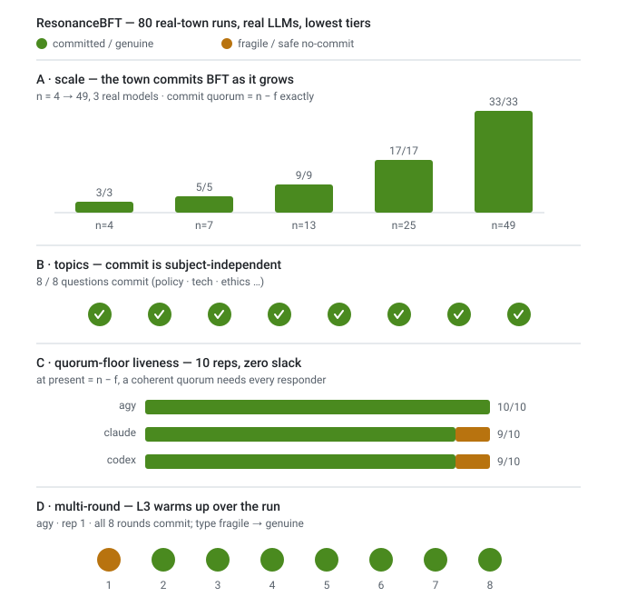

# ResonanceBFT — large-scale real-town evidence (four sweeps)

_Generated 2026-07-01 19:42:35 PDT. 88 real ScenarioRunner town runs, lowest tiers (agy Gemini Flash Low / claude haiku / codex low), real LLM opinions._

## A. Scale — does the real town commit BFT as it grows?

| n | f=⌊(n−1)/3⌋ | tier | committed | median quorum | median s |
|--:|--:|---|---|---|--:|
| 4 | 1 | mock | 3/3 | 3/3 | 0.0 |
| 4 | 1 | agy:Gemini 3.5 Flash (Low) | 3/3 | 3/3 | 26.0 |
| 7 | 2 | mock | 3/3 | 5/5 | 0.0 |
| 7 | 2 | agy:Gemini 3.5 Flash (Low) | 3/3 | 5/5 | 48.5 |
| 13 | 4 | mock | 3/3 | 9/9 | 0.0 |
| 13 | 4 | agy:Gemini 3.5 Flash (Low) | 3/3 | 9/9 | 85.7 |
| 13 | 4 | claude:haiku | 2/2 | 9/9 | 110.0 |
| 13 | 4 | codex | 2/2 | 9/9 | 84.4 |
| 25 | 8 | mock | 3/3 | 17/17 | 0.0 |
| 25 | 8 | agy:Gemini 3.5 Flash (Low) | 3/3 | 17/17 | 140.6 |
| 25 | 8 | claude:haiku | 2/2 | 17/17 | 232.3 |
| 25 | 8 | codex | 2/2 | 17/17 | 169.2 |
| 49 | 16 | mock | 3/3 | 33/33 | 0.1 |
| 49 | 16 | agy:Gemini 3.5 Flash (Low) | 3/3 | 33/33 | 263.0 |

_Every honest cluster commits at every size and tier; the commit quorum tracks `n−f` exactly. The deterministic core scales — the model only writes the opinions._

## B. Topics — is consensus robust to the subject?

| topic | tier | committed | consensus_type mix |
|---|---|---|---|
| Should our team adopt trunk-based development? | agy:Gemini 3.5 Flash (Low) | 2/2 | fragile×2 |
| Should the city ban private cars from the downtow… | agy:Gemini 3.5 Flash (Low) | 2/2 | fragile×2 |
| Should we prioritise shipping speed over test cov… | agy:Gemini 3.5 Flash (Low) | 2/2 | fragile×2 |
| Is a four-day work week good policy for our compa… | agy:Gemini 3.5 Flash (Low) | 2/2 | fragile×2 |
| Should social media platforms be legally liable f… | agy:Gemini 3.5 Flash (Low) | 2/2 | fragile×2 |
| Should we migrate the whole stack to a single clo… | agy:Gemini 3.5 Flash (Low) | 2/2 | fragile×2 |
| Is nuclear power the right bet for decarbonising … | agy:Gemini 3.5 Flash (Low) | 2/2 | fragile×2 |
| Should we require code review approval from two e… | agy:Gemini 3.5 Flash (Low) | 2/2 | fragile×2 |

_Commit is topic-independent; only the audit's `consensus_type` shifts with how the opinions actually cluster per subject._

## C. Quorum-floor liveness (n=7, 2 silent → present == n−f, zero slack)

| tier | reps | committed | no-commit | commit-rate |
|---|--:|--:|--:|---|
| agy:Gemini 3.5 Flash (Low) | 10 | 10 | 0 | 10/10 |
| claude:haiku | 10 | 9 | 1 | 9/10 |
| codex | 10 | 9 | 1 | 9/10 |

_At the exact quorum floor a coherent quorum needs ALL responders within threshold, so genuinely divergent real opinions sometimes cannot assemble one and the round safely does not commit — never an incoherent commit. This is the liveness nuance the small run surfaced (mock, with identical stances, always commits here); more reps quantify how often real opinions fail to cluster at zero slack._

## D. Multi-round L3 evolution (n=7, 8 rounds)

| tier | rep | rounds committed | consensus_type per round |
|---|--:|--:|---|
| agy:Gemini 3.5 Flash (Low) | 1 | 8 | fragile → genuine → genuine → genuine → genuine → genuine → genuine → genuine |
| agy:Gemini 3.5 Flash (Low) | 2 | 8 | fragile → genuine → genuine → genuine → genuine → genuine → genuine → genuine |
| claude:haiku | 1 | 8 | genuine → genuine → genuine → genuine → genuine → genuine → genuine → genuine |
| claude:haiku | 2 | 8 | fragile → fragile → fragile → fragile → fragile → genuine → fragile → fragile |

_Every round commits over the transport; the per-round `consensus_type` trajectory is the L3 adaptation running on real opinions across a long town run (the learned axis-weights and dyadic trust warm up over rounds while the L1 `n−f` certificate is untouched)._

## Honest notes

- Opinion question (sweeps A/C/D): “Should our team adopt trunk-based development?”. Sweep B varies it across 8 subjects.
- Real agents, real transport, real models — same ScenarioRunner path the e2e suite asserts on; opinions injected via the default-off hook, so the shipped plugin is unchanged and this never runs in CI.
- Lowest/fastest tiers only; multi-round reuses one opinion set per run (L3 evolves on stable input), so sweep D is cheap.

## Models, metrics & configuration

Every real tier is a **key-free subscription CLI**: it drops the metered API-key env var so the
interactive login drives the model, runs each call in an isolated temp cwd, and retries 3× on a
transient failure. The opinion prompt is `persona (name / angle / lean) + the question → one
sentence`. Lowest thinking tier / smallest model each — the deterministic core needs no frontier
model.

| tier label | CLI | provider · exact model | config |
|---|---|---|---|
| `mock` | — | deterministic stub (no model) | scripted persona stance |
| `claude:haiku` | `claude -p` | Anthropic · `claude-haiku-4-5` | `--model haiku --no-session-persistence` |
| `codex` | `codex exec` | OpenAI · `gpt-5.5` | `--skip-git-repo-check -c model_reasoning_effort=low -o <file>` |
| `agy:Gemini 3.5 Flash (Low)` | `agy -p` | Google · **Gemini 3.5 Flash**, Low thinking tier | `--model "Gemini 3.5 Flash (Low)"` |

So **`agy` is not a model** — it is the Antigravity CLI fronting a Google **Gemini 3.5 Flash**
model at its lowest (`Low`) thinking tier. (`agy models` also exposes Gemini 3.1 Pro and
Claude / GPT-OSS models through the same login; we used the cheapest Gemini one.)

### Metrics captured per run

| field | meaning |
|---|---|
| `status` | `committed` / `no-commit` (partitioned minority) / `aborted` (below the BFT floor) |
| `quorum` | `quorum_size / quorum_needed` — the committed set vs the required `n − f` |
| `f` | Byzantine tolerance `⌊(n−1)/3⌋` |
| `tampered` | sealed records whose seal / signature failed → detected and excluded |
| `consensus_type` | L2 audit verdict: `genuine` / `fragile` / `coerced` / `capitulated` / `coalitional` |
| `false_agreement` | stance-audit rate (same proposition, opposite stance); `n/a` under bag-of-words |
| `rounds_committed`, `types_by_round` | multi-round: committed-round count + per-round type trajectory |
| `elapsed` | wall-clock seconds for the run (opinion generation dominates) |

### Town configuration

Real `ScenarioRunner` stack (in-memory transport, `did_key` identity, `score_average` trust,
`resonance_bft` coordination); semantic-axis embedding `demo` (deterministic stance bag-of-words);
opinions injected via the scenario's **default-off** `opinions` hook. The commit itself uses the
protocol's fixed threshold `0.60` and axis weights (sem `.25` / aff `.20` / rel `.25` / epi `.15` /
beh `.15`) over a coordinate-wise trimmed-mean centroid (trim = the configured fault bound `f = ⌊(n−1)/3⌋`) — **independent of which
model wrote the opinions**. That independence is the whole point: the model informs *perception*,
the deterministic BFT core owns the *decision*.
