# ResonanceBFT — architecture diagrams

Eighteen self-contained SVGs (embedded styles + `prefers-color-scheme`, so they render in both
light and dark on GitHub). Referenced from the PR body and the module docs.

## 1. Overall architecture

The four layers and the consensus flow. L0 (perception, five pentadic axes) feeds L1 (the
deterministic `n − f` BFT commit — the only safety certificate); L2 audits and L3 adapts, but
**neither ever alters the L1 commit**. The LLM's nondeterministic output is sealed at
`participate()`, so the commit is a pure, resolver-independent function of the sealed vectors.

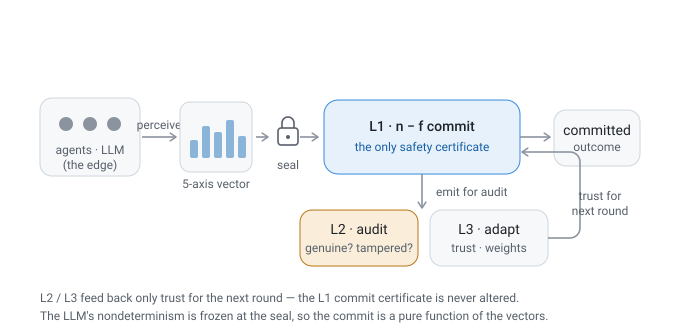

## 2. What is novel

The contributions grouped into two **safety-critical** pillars (value-space consensus,
cryptographic integrity) and one **non-safety** pillar (social interpretation) that never touches
the L1 certificate. Novelty = classic BFT safety + agreement over a continuous value space + a
social-science audit, with L1 provably unweakened.

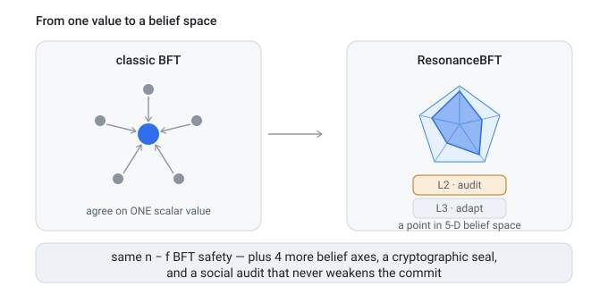

## 3. Consensus in embedding space (3-D)

High-dimensional belief vectors projected to 3-D. Each of four agents (its own colour) is a
**moving point** whose long **comet-trail trajectory** ends in a **velocity arrow** — the push
toward agreement — converging into a **consensus domain that floats in the space** (concentric
elliptical projection rings, not rings on the floor). Its **elliptical bullseye** centre is the
committed trimmed-mean centroid. A Byzantine trajectory diverges out of the domain and is detected + excluded (marked
✗), so it **cannot pull the commit** (box validity).

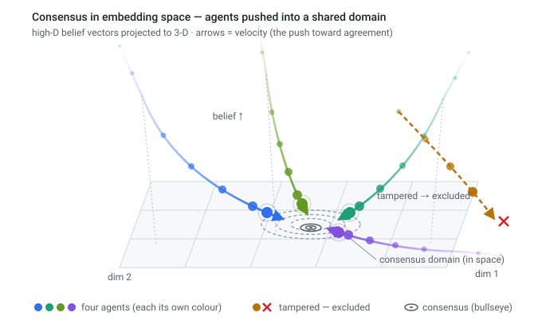

## 4. Multi-dimensional vectorization

An opinion is sealed and vectorised into **five independent axes**, each with its own value — an
irregular radar, not a regular pentagon. That per-axis spread is the multi-dimensionality a single
scalar vote would collapse.

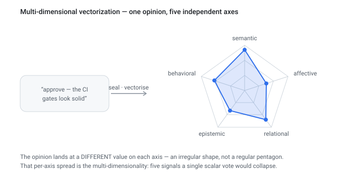

## 5. Vector comparison

Two agents' five-axis vectors are overlaid; each axis gives a cosine similarity; the fixed axis
weights combine them into one alignment score, compared to the `0.60` commit threshold.

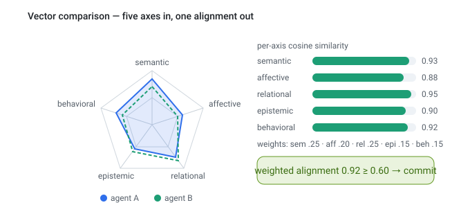

## 6. Temporal trace tracking (LSTM-like)

The belief state is captured every round; the **sequence** of five-dimensional states (not just the
last) is read by a trajectory classifier — velocity, concession symmetry, evidence-δ — to name one of
nine types, telling real agreement from social pressure.

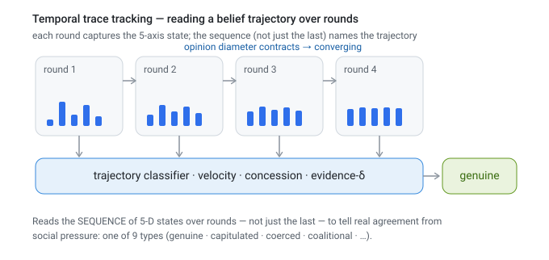

## 7. Quorum intersection — why n − f is safe

Any two `n−f` quorums share ≥ `f+1` nodes; with only `f` Byzantine, that overlap always contains
≥ 1 honest node, so two quorums can never commit conflicting values (no split-brain).

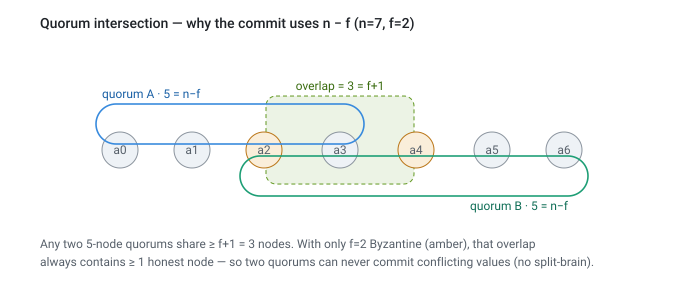

## 8. Sealed commitments — tamper-evidence

The five belief axes plus a nonce are hashed (SHA-256) and ed25519-signed; mutating any sealed
value makes the digest mismatch, so `resolve()` flags the record tampered and drops it.

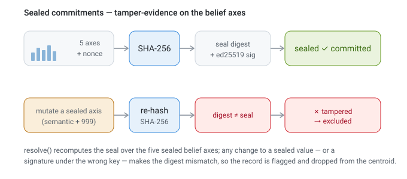

## 9. Box validity — a Byzantine extreme can't pull the commit

The coordinate-wise trimmed mean stays inside the honest per-coordinate box even with a Byzantine
extreme, while the plain mean is dragged out — box validity at `n ≥ 3f+1` (vs convex's `7f+1`).

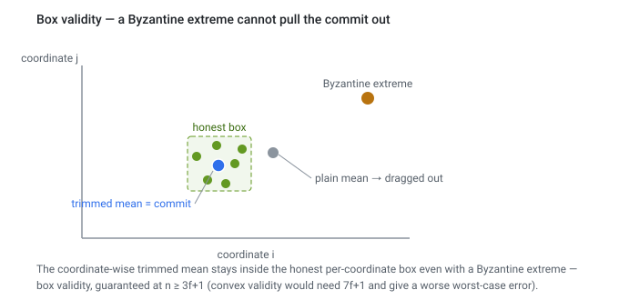

## 10. Trimmed-mean robustness (measured)

Two colluding vectors pull the plain mean below the `0.60` commit threshold (cosine `0.55`); the
trimmed mean stays aligned at `0.99` — `test_resists_biased_minority`.

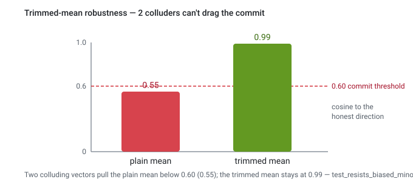

## 11. Deliberation convergence

Bounded-confidence (Hegselmann–Krause) averaging monotonically contracts the honest opinion
diameter each step (`1.61 → 1.34`) — `test_deliberation_contracts_opinion_diameter`.

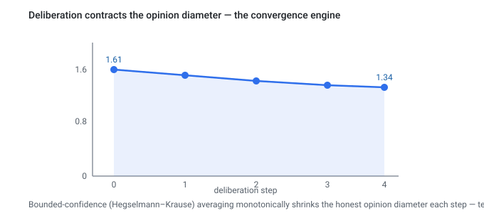

## 12. Test pyramid

321 plugin tests: unit + Hypothesis property (base), Byzantine validators, end-to-end town runs,
and one live real-LLM test (apex, CI-excluded). 1057 whole-repo, pyright 0, ruff clean.

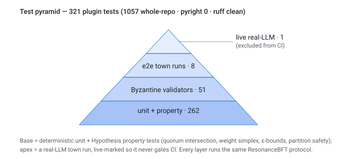

## 13. Scale results

The real town commits at `n = 4→49` with the quorum tracking `n−f` exactly (`3/3 → 33/33`), on
mock + Gemini at every size and claude-haiku + gpt-5.5 at n=13, 25.

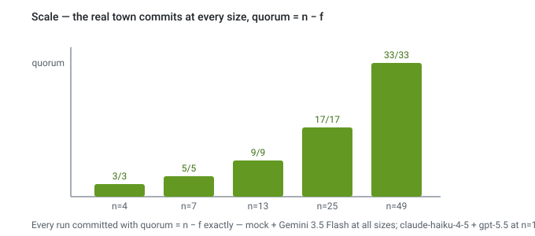

## 14. Scenario × model outcome matrix

Five town scenarios across four models reach the same designed outcome — genuine/silent/bow
commit, byzantine commits with `tampered=2`, partition never commits — so the decision is
model-agnostic. At the zero-slack floor, commit rate is agy 10/10 · claude 9/10 · codex 9/10.

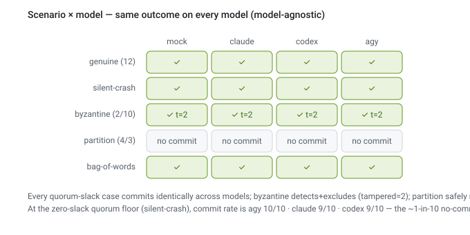

## 15. One agent's lifecycle across the rounds (time-series)

A single agent tracked over twelve rounds, split into three coloured **phase bands** — `cold-start`,
`converging`, `consensus`. Top panel: **opinion** converges and **trust** rises after a shielded
grace start, with a dip at the **view-change** where the leader rotates. Its own strip: a **learned
axis-weight** hesitates then warms up (slow). Bottom strip: **evidence-δ** signed each round
(+ persuasion / − pressure). The three line speeds are the three adaptation timescales — none of
which alter the L1 `n − f` commit.

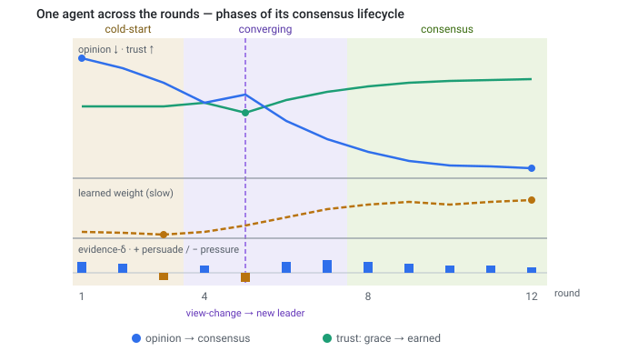

## 16. Many agents converging over rounds (time-series)

The multi-agent companion to #15: five honest agents' opinions start spread wide, then contract
through the `spread → converging → agreed` phases into a shaded consensus **funnel** and reach the
commit **bullseye**, while a Byzantine agent stays outside and is excluded. (Read #15 → #16 → #3
as: one agent over time → many agents over time → many agents in embedding space.)

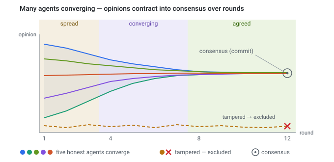

## 17. Byzantine defense-in-depth (integrated)

One matrix, five attacks × defense × guarantee: tamper→seal, collude→trimmed mean (box validity),
newcomer-capture→reputation dampening, equivocation→conflict certificate, overwhelm→`n−f` abort.
Safety never rests on one mechanism.

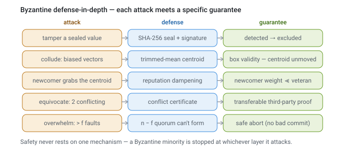

## 18. From words to a trustworthy signal (integrated)

The perception→audit pipeline with embedded mini-charts: a contextual **encoder** separates stance
(fastembed 1.00 vs static 0.67), fixed **axis weights** stop dimensionality domination, and the
**false-consensus audit** flags same-topic/opposite-stance rounds (`false_agreement` 0.55 vs 0.0).

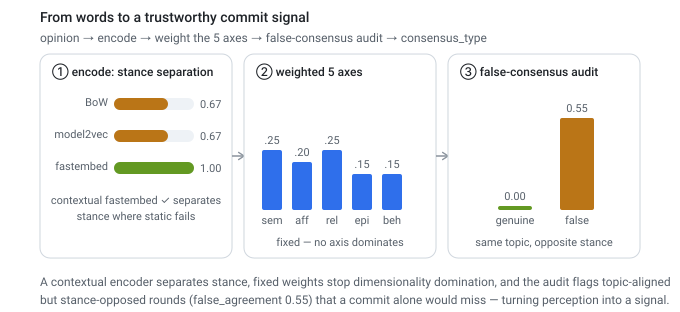
