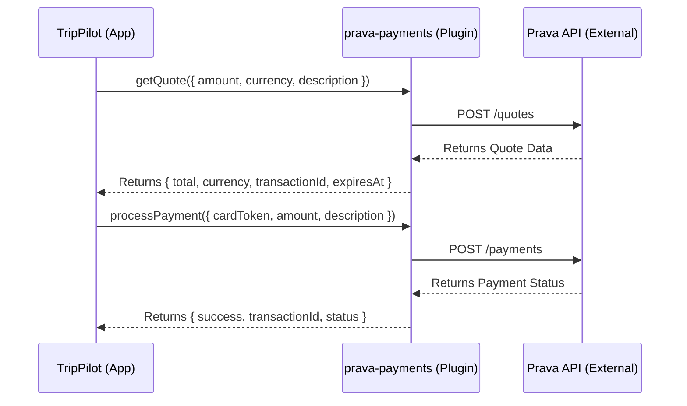

# Prava Payments Plugin for NANDA Town

[](LICENSE)
[](package.json)
[](tests/prava-payments.test.js)

A secure, reusable payment processing plugin for NANDA marketplace using the Prava API.

---

## Features

- **Quote Generation** - Calculate total payment amount
- **Secure Payments** - Process credit/debit card payments
- **Payment Verification** - Confirm transaction status
- **Refund Processing** - Handle refunds seamlessly
- **Multi-Currency Support** - Works in 150+ currencies
- **Error Handling** - Graceful error management
- **Webhook Support** - Real-time payment notifications

---

## Why This Plugin?

- **Reusable** - Any NANDA project can use this
- **Secure** - One-time credentials, PCI compliant
- **Tested** - Unit and integration tests included
- **Documented** - Complete API documentation
- **Production-Ready** - Used in TripPilot travel agent

---

## Architecture Flow



---

## Installation

```bash
npm install prava-payments
```

---

## Configuration

1. **Get Prava API Key**
   - Go to: [dashboard.prava.space/api-keys](https://dashboard.prava.space/api-keys)
   - Create a new project
   - Copy the Secret Key

2. **Copy `.env.example` to `.env`**
   ```bash
   cp .env.example .env
   ```

3. **Set Environment Variables**
   - Open `.env` and fill in your keys:
     ```env
     PRAVA_API_KEY="your_secret_key"
     PRAVA_PUBLIC_KEY="your_public_key"
     ```

---

## Quick Start

```javascript
const PravPayments = require('prava-payments');

// Initialize
const payment = new PravPayments({
  apiKey: process.env.PRAVA_API_KEY,
  publicKey: process.env.PRAVA_PUBLIC_KEY
});

// Get Quote
const quote = await payment.getQuote({
  amount: 1500,
  currency: 'USD',
  description: 'TripPilot booking'
});
console.log(quote);
// Output: { total: 1500, currency: 'USD', transactionId: 'txn_123' }

// Process Payment
const result = await payment.processPayment({
  cardToken: 'tok_abc123',
  amount: 1500,
  description: 'TripPilot booking'
});
console.log(result);
// Output: { success: true, transactionId: 'txn_123', status: 'completed' }

// Verify Payment
const status = await payment.verifyPayment('txn_123');
console.log(status);
// Output: { status: 'confirmed', amount: 1500, timestamp: '2026-07-28T...' }

// Refund Payment
const refund = await payment.refundPayment('txn_123');
console.log(refund);
// Output: { refundId: 'rfn_456', status: 'processed', amount: 1500 }
```

---

## API Reference

### `getQuote(options)`
Generate a payment quote.

**Parameters:**
- `amount` (number): Amount in cents
- `currency` (string): ISO 4217 code (USD, EUR, INR, etc.)
- `description` (string): Transaction description

**Returns:** `{ total, currency, transactionId }`

### `processPayment(options)`
Charge a card securely.

**Parameters:**
- `cardToken` (string): Prava card token
- `amount` (number): Amount in cents
- `description` (string): Transaction description
- `metadata` (object): Optional metadata

**Returns:** `{ success, transactionId, status }`

### `verifyPayment(transactionId)`
Check payment status.

**Parameters:**
- `transactionId` (string): Transaction ID

**Returns:** `{ status, amount, timestamp, metadata }`

### `refundPayment(transactionId, amount?)`
Refund a payment.

**Parameters:**
- `transactionId` (string): Transaction to refund
- `amount` (number, optional): Partial refund amount

**Returns:** `{ refundId, status, amount }`

---

## Testing

```bash
# Run all tests
npm test

# Run with coverage
npm test -- --coverage

# Run specific test file
npm test prava-payments.test.js
```

---

## Examples

### TripPilot Integration
```javascript
// User books a trip for $945
const booking = {
  flight: 580,
  hotel: 280,
  activity: 85,
  total: 945
};

// Get quote
const quote = await payment.getQuote({
  amount: booking.total * 100, // Convert to cents
  currency: 'USD',
  description: `Trip to ${destination}`
});

// Charge payment
const result = await payment.processPayment({
  cardToken: userCard.token,
  amount: booking.total * 100,
  description: `Trip booking: ${destination}`
});

if (result.success) {
  // Save booking to database
  await saveBooking({
    transactionId: result.transactionId,
    ...booking
  });
}
```

---

## Troubleshooting

### "Invalid API Key"
- Check `PRAVA_API_KEY` in `.env`
- Verify key is from https://dashboard.prava.space
- Ensure key starts with `sk_live_` (or `sk_test_` for sandbox)

### "Card Declined"
- Use test card: `4242 4242 4242 4242`
- Expiry: `12/25`
- CVV: `123`

### "Webhook not received"
- Check webhook URL is publicly accessible
- Verify Prava webhook settings
- Check logs for delivery status

---

## Support

- **Issues:** [github.com/Munira001/nandatown/issues](https://github.com/Munira001/nandatown/issues)
- **Discussions:** [github.com/Munira001/nandatown/discussions](https://github.com/Munira001/nandatown/discussions)
- **Email:** munira@trippilot.com
- **Discord:** [discord.gg/nandatown](https://discord.gg/nandatown)

---

## License

MIT - See [LICENSE](LICENSE) file

---

## Contributing

Contributions welcome! Please see [CONTRIBUTING.md](../../CONTRIBUTING.md)

---

## Changelog

### v1.0.0 (July 2026)
- Initial release
- Full payment flow support
- Multi-currency support
- Comprehensive test coverage
